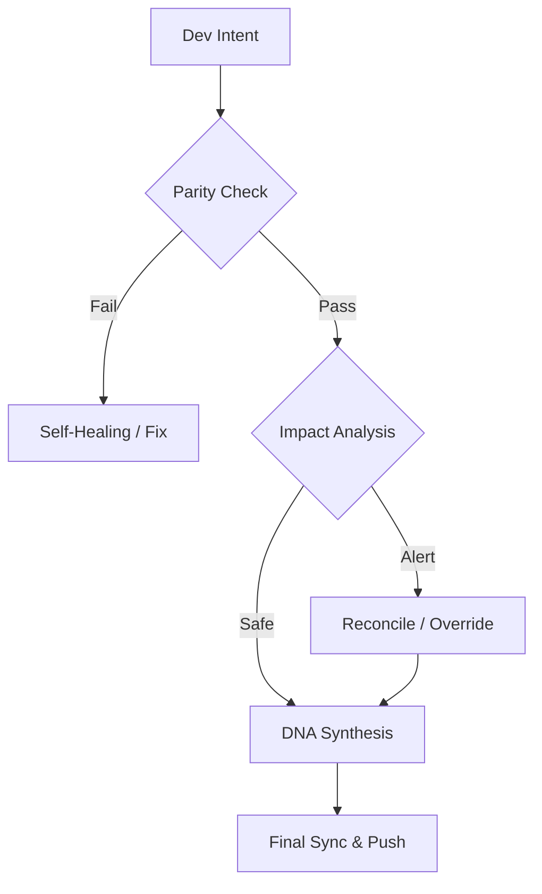

# Continuity Legacy v1.3.1: Globales Kontinuitäts-Framework

#### Editions
[](https://github.com/SteveBlackbeard/CONTINUITY-LEGACY-by-Ethernium/blob/main/continuity-lite/) [](https://github.com/SteveBlackbeard/CONTINUITY-LEGACY-by-Ethernium/blob/main/continuity/) [](https://github.com/SteveBlackbeard/CONTINUITY-LEGACY-by-Ethernium/blob/main/continuity-omega/)

#### Languages
[](https://github.com/SteveBlackbeard/CONTINUITY-LEGACY-by-Ethernium/blob/main/OTHER_LANGUAGES/README_es.md) [](https://github.com/SteveBlackbeard/CONTINUITY-LEGACY-by-Ethernium/blob/main/README.md) [](https://github.com/SteveBlackbeard/CONTINUITY-LEGACY-by-Ethernium/blob/main/OTHER_LANGUAGES/README_ja.md) [](https://github.com/SteveBlackbeard/CONTINUITY-LEGACY-by-Ethernium/blob/main/OTHER_LANGUAGES/README_zh.md) [](https://github.com/SteveBlackbeard/CONTINUITY-LEGACY-by-Ethernium/blob/main/OTHER_LANGUAGES/README_ru.md) [](https://github.com/SteveBlackbeard/CONTINUITY-LEGACY-by-Ethernium/blob/main/OTHER_LANGUAGES/README_fr.md) [](https://github.com/SteveBlackbeard/CONTINUITY-LEGACY-by-Ethernium/blob/main/OTHER_LANGUAGES/README_it.md) [](https://github.com/SteveBlackbeard/CONTINUITY-LEGACY-by-Ethernium/blob/main/OTHER_LANGUAGES/README_de.md) [](https://github.com/SteveBlackbeard/CONTINUITY-LEGACY-by-Ethernium/blob/main/OTHER_LANGUAGES/README_pt.md)

#### Languages
[](https://github.com/SteveBlackbeard/CONTINUITY-LEGACY-by-Ethernium/blob/main/OTHER_LANGUAGES/README_es.md) [](https://github.com/SteveBlackbeard/CONTINUITY-LEGACY-by-Ethernium/blob/main/README.md) [](https://github.com/SteveBlackbeard/CONTINUITY-LEGACY-by-Ethernium/blob/main/OTHER_LANGUAGES/README_ja.md) [](https://github.com/SteveBlackbeard/CONTINUITY-LEGACY-by-Ethernium/blob/main/OTHER_LANGUAGES/README_zh.md) [](https://github.com/SteveBlackbeard/CONTINUITY-LEGACY-by-Ethernium/blob/main/OTHER_LANGUAGES/README_ru.md) [](https://github.com/SteveBlackbeard/CONTINUITY-LEGACY-by-Ethernium/blob/main/OTHER_LANGUAGES/README_fr.md) [](https://github.com/SteveBlackbeard/CONTINUITY-LEGACY-by-Ethernium/blob/main/OTHER_LANGUAGES/README_it.md) [](https://github.com/SteveBlackbeard/CONTINUITY-LEGACY-by-Ethernium/blob/main/OTHER_LANGUAGES/README_de.md) [](https://github.com/SteveBlackbeard/CONTINUITY-LEGACY-by-Ethernium/blob/main/OTHER_LANGUAGES/README_pt.md)

[](https://github.com/SteveBlackbeard/CONTINUITY-LEGACY-by-Ethernium)
[](https://opensource.org/licenses/MIT)
[](https://www.python.org/)
[](https://github.com/SteveBlackbeard/CONTINUITY-LEGACY-by-Ethernium)
[](https://github.com/SteveBlackbeard/CONTINUITY-LEGACY-by-Ethernium)

**Continuity** ist ein professionelles Synchronisations-Framework, das die logische Abstammung Ihrer Software bei KI-Mensch- und KI-KI-Übergaben schützt. Es stellt sicher, dass Entwicklungsabsicht, architektonische Entscheidungen und taktischer Kontext niemals verloren gehen.

---

## 🚀 Schnellinstallation

```bash
# 1. Repository klonen
git clone https://github.com/SteveBlackbeard/CONTINUITY-LEGACY-by-Ethernium.git
cd CONTINUITY-LEGACY-by-Ethernium

# 2. Lite-Edition installieren (Empfohlen für den täglichen Gebrauch)
pip install -e continuity-lite

# 3. Git-Grenzwächter einrichten
python continuity-lite/run_continuity_lite.py --hook
```

---

## ⚡ Minimale Nutzung (5-Zeilen-Start)

```python
# Führen Sie einfach den Wächter in Ihrem Terminal aus
python continuity-lite/run_continuity_lite.py

# Erwartete Ausgabe:
# [*] CONTINUITY LEGACY Lite - DNA-Validierung
# [] Parität Bestätigt. Bereit für sichere Übergabe.
```

---

## 🔍 Der Qualitätsfluss (Der Grenzwächter)

Continuity fungiert als "Sokratische Firewall" für Ihr Projekt. So wird Ihre Designabsicht geschützt:



---

## 🏢 Choose Your Edition

[](../continuity-lite)
<p align="center"><sub><b>Continuity Legacy Lite</b>: Minimale lokale Synchronisation mit DNA-Synthese für verlustfreien Kontexttransfer.</sub></p>

[](../continuity)
<p align="center"><sub><b>Continuity Legacy Pro</b>: Industrieller Grenzwächter mit Sicherheitsaudits und globaler Synchronisation.</sub></p>

[](../continuity-omega)
<p align="center"><sub><b>Continuity Legacy Omega</b>: Fortgeschrittenes RAG, kognitive Kartierung und proaktive Wirkungsanalyse.</sub></p>

### 🧠 Omega-Edition: Kognitive Einsicht *(In Entwicklung)*
Die **Omega-Edition** ist unsere Enterprise-Stufe. Sie bietet eine visuelle, interaktive Entscheidungslinie und semantische Wirkungsanalyse zur Vermeidung architektonischer Drift.


---

## 🌌 Ursprünge: Das Ethernium-Erbe

**Continuity Legacy** entstand aus der Notwendigkeit innerhalb des **Ethernium-Ökosystems**—einer riesigen, sich entwickelnden Grenze des kognitiven Rechnens und autonomer Systeme. Als Ethernium an Komplexität zunahm, wurde die Notwendigkeit, Zustand, Absicht und architektonische Abstammung zu bewahren, überragend.

Dieses Framework ist eine spezialisierte Extraktion aus diesem Ökosystem, verfeinert und gehärtet für eigenständige, produktionsbereite Nutzung. Mit Continuity übernehmen Sie ein Stück der Ethernium-Philosophie: *ewiger Zustand, ungebrochene Abstammung und kognitive Integrität.*

---

## 🏷️ Schlüsselwörter
`context-management`, `ai-memory`, `rag-framework`, `project-continuity`, `decision-logging`, `software-governance`

---
*Continuity: Die logische Abstammung Ihrer Software schützen.*
