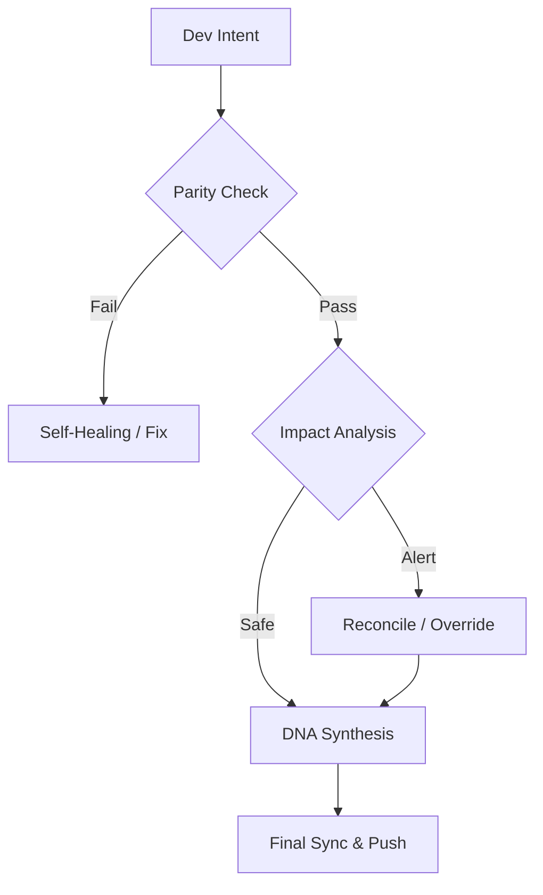

#### Languages
[](https://github.com/SteveBlackbeard/CONTINUITY-LEGACY-by-Ethernium/blob/main/OTHER_LANGUAGES/RELEASE_v2.1.0_es.md) [](https://github.com/SteveBlackbeard/CONTINUITY-LEGACY-by-Ethernium/blob/main/RELEASE_NOTES_MANIFEST.md) [](https://github.com/SteveBlackbeard/CONTINUITY-LEGACY-by-Ethernium/blob/main/OTHER_LANGUAGES/RELEASE_v2.1.0_ja.md) [](https://github.com/SteveBlackbeard/CONTINUITY-LEGACY-by-Ethernium/blob/main/OTHER_LANGUAGES/RELEASE_v2.1.0_zh.md) [](https://github.com/SteveBlackbeard/CONTINUITY-LEGACY-by-Ethernium/blob/main/OTHER_LANGUAGES/RELEASE_v2.1.0_ru.md) [](https://github.com/SteveBlackbeard/CONTINUITY-LEGACY-by-Ethernium/blob/main/OTHER_LANGUAGES/RELEASE_v2.1.0_fr.md) [](https://github.com/SteveBlackbeard/CONTINUITY-LEGACY-by-Ethernium/blob/main/OTHER_LANGUAGES/RELEASE_v2.1.0_it.md) [](https://github.com/SteveBlackbeard/CONTINUITY-LEGACY-by-Ethernium/blob/main/OTHER_LANGUAGES/RELEASE_v2.1.0_de.md) [](https://github.com/SteveBlackbeard/CONTINUITY-LEGACY-by-Ethernium/blob/main/OTHER_LANGUAGES/RELEASE_v2.1.0_pt.md)

[](https://github.com/SteveBlackbeard/CONTINUITY-LEGACY-by-Ethernium) [](https://opensource.org/licenses/MIT) [](https://www.python.org/) [](https://github.com/SteveBlackbeard/CONTINUITY-LEGACY-by-Ethernium) [](https://github.com/SteveBlackbeard/CONTINUITY-LEGACY-by-Ethernium/actions/workflows/global_sync.yml) [](https://github.com/SteveBlackbeard/CONTINUITY-LEGACY-by-Ethernium)

<p align="center">
<a href="https://github.com/SteveBlackbeard/CONTINUITY-LEGACY-by-Ethernium">

</a>
</p>

# Continuity Legacy v2.1.0: Globales Kontinuitäts-Framework

Continuity is now structured into three specialized editions to provide the right level of governance for every project:

[](https://github.com/SteveBlackbeard/CONTINUITY-LEGACY-by-Ethernium/blob/main/continuity-lite/)
[](https://github.com/SteveBlackbeard/CONTINUITY-LEGACY-by-Ethernium/blob/main/continuity-pro/)
[](https://github.com/SteveBlackbeard/CONTINUITY-LEGACY-by-Ethernium/blob/main/continuity-omega/)


#### Languages
[](https://github.com/SteveBlackbeard/CONTINUITY-LEGACY-by-Ethernium/blob/main/OTHER_LANGUAGES/README_es.md) [](https://github.com/SteveBlackbeard/CONTINUITY-LEGACY-by-Ethernium/blob/main/README.md) [](https://github.com/SteveBlackbeard/CONTINUITY-LEGACY-by-Ethernium/blob/main/OTHER_LANGUAGES/README_ja.md) [](https://github.com/SteveBlackbeard/CONTINUITY-LEGACY-by-Ethernium/blob/main/OTHER_LANGUAGES/README_zh.md) [](https://github.com/SteveBlackbeard/CONTINUITY-LEGACY-by-Ethernium/blob/main/OTHER_LANGUAGES/README_ru.md) [](https://github.com/SteveBlackbeard/CONTINUITY-LEGACY-by-Ethernium/blob/main/OTHER_LANGUAGES/README_fr.md) [](https://github.com/SteveBlackbeard/CONTINUITY-LEGACY-by-Ethernium/blob/main/OTHER_LANGUAGES/README_it.md) [](https://github.com/SteveBlackbeard/CONTINUITY-LEGACY-by-Ethernium/blob/main/OTHER_LANGUAGES/README_de.md) [](https://github.com/SteveBlackbeard/CONTINUITY-LEGACY-by-Ethernium/blob/main/OTHER_LANGUAGES/README_pt.md)

[](https://github.com/SteveBlackbeard/CONTINUITY-LEGACY-by-Ethernium)
[](https://opensource.org/licenses/MIT)
[](https://www.python.org/)
[](https://github.com/SteveBlackbeard/CONTINUITY-LEGACY-by-Ethernium)
[](https://github.com/SteveBlackbeard/CONTINUITY-LEGACY-by-Ethernium)

**Continuity** ist ein professionelles Synchronisations-Framework, das die logische Abstammung Ihrer Software bei KI-Mensch- und KI-KI-Übergaben schützt. Es stellt sicher, dass Entwicklungsabsicht, architektonische Entscheidungen und taktischer Kontext niemals verloren gehen.


## 🏢 Wählen Sie Ihre Edition

[](https://github.com/SteveBlackbeard/CONTINUITY-LEGACY-by-Ethernium/tree/main/continuity-lite)
<p align="center"><sub><b>Continuity Legacy Lite — Reibungsloser Wächter</b>: Minimalistische lokale Synchronisation mit DNA-Synthese für verlustfreie Übergaben.</sub></p>

[](https://github.com/SteveBlackbeard/CONTINUITY-LEGACY-by-Ethernium/tree/main/continuity-pro)
<p align="center"><sub><b>Continuity Legacy Pro — Taktische Engine</b>: Industrieller Grenzschutz mit Sicherheitsaudits und globaler Synchronisation.</sub></p>

[](https://github.com/SteveBlackbeard/CONTINUITY-LEGACY-by-Ethernium/tree/main/continuity-omega)
<p align="center"><sub><b>Continuity Legacy Omega — Enterprise-Orakel</b>: Erweitertes RAG, kognitives Mapping und proaktive Auswirkungsanalyse.</sub></p>

---


## 🚀 Schnellinstallation

```bash
# Run the DNA validation cycle
continuity-lite
```

---

## 🔍 Der Qualitätsfluss (Der Grenzwächter)

Continuity fungiert als "Sokratische Firewall" für Ihr Projekt. So wird Ihre Designabsicht geschützt:



---

### 🧠 Omega-Edition: Kognitive Einsicht *(In Entwicklung)*
Die **Omega-Edition** ist unsere Enterprise-Stufe. Sie bietet eine visuelle, interaktive Entscheidungslinie und semantische Wirkungsanalyse zur Vermeidung architektonischer Drift.


---

## 🌌 Ursprünge: Das Ethernium-Erbe

**Continuity Legacy** entstand aus der Notwendigkeit innerhalb des **Ethernium-Ökosystems**—einer riesigen, sich entwickelnden Grenze des kognitiven Rechnens und autonomer Systeme. Als Ethernium an Komplexität zunahm, wurde die Notwendigkeit, Zustand, Absicht und architektonische Abstammung zu bewahren, überragend.

Dieses Framework ist eine spezialisierte Extraktion aus diesem Ökosystem, verfeinert und gehärtet für eigenständige, produktionsbereite Nutzung. Mit Continuity übernehmen Sie ein Stück der Ethernium-Philosophie: *ewiger Zustand, ungebrochene Abstammung und kognitive Integrität.*

---

## 🏷️ Schlüsselwörter
`context-management`, `ai-memory`, `rag-framework`, `project-continuity`, `decision-logging`, `software-governance`

---
*Continuity: Die logische Abstammung Ihrer Software schützen.*
