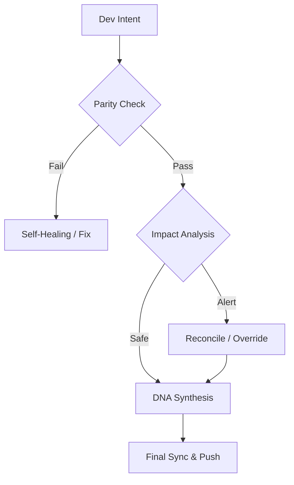

# Continuity Legacy v1.3.1: Marco de Continuidad Global

#### Editions
[](https://github.com/SteveBlackbeard/CONTINUITY-LEGACY-by-Ethernium/blob/main/continuity-lite/) [](https://github.com/SteveBlackbeard/CONTINUITY-LEGACY-by-Ethernium/blob/main/continuity/) [](https://github.com/SteveBlackbeard/CONTINUITY-LEGACY-by-Ethernium/blob/main/continuity-omega/)

#### Languages
[](https://github.com/SteveBlackbeard/CONTINUITY-LEGACY-by-Ethernium/blob/main/OTHER_LANGUAGES/README_es.md) [](https://github.com/SteveBlackbeard/CONTINUITY-LEGACY-by-Ethernium/blob/main/README.md) [](https://github.com/SteveBlackbeard/CONTINUITY-LEGACY-by-Ethernium/blob/main/OTHER_LANGUAGES/README_ja.md) [](https://github.com/SteveBlackbeard/CONTINUITY-LEGACY-by-Ethernium/blob/main/OTHER_LANGUAGES/README_zh.md) [](https://github.com/SteveBlackbeard/CONTINUITY-LEGACY-by-Ethernium/blob/main/OTHER_LANGUAGES/README_ru.md) [](https://github.com/SteveBlackbeard/CONTINUITY-LEGACY-by-Ethernium/blob/main/OTHER_LANGUAGES/README_fr.md) [](https://github.com/SteveBlackbeard/CONTINUITY-LEGACY-by-Ethernium/blob/main/OTHER_LANGUAGES/README_it.md) [](https://github.com/SteveBlackbeard/CONTINUITY-LEGACY-by-Ethernium/blob/main/OTHER_LANGUAGES/README_de.md) [](https://github.com/SteveBlackbeard/CONTINUITY-LEGACY-by-Ethernium/blob/main/OTHER_LANGUAGES/README_pt.md)

#### Languages
[](https://github.com/SteveBlackbeard/CONTINUITY-LEGACY-by-Ethernium/blob/main/OTHER_LANGUAGES/README_es.md) [](https://github.com/SteveBlackbeard/CONTINUITY-LEGACY-by-Ethernium/blob/main/README.md) [](https://github.com/SteveBlackbeard/CONTINUITY-LEGACY-by-Ethernium/blob/main/OTHER_LANGUAGES/README_ja.md) [](https://github.com/SteveBlackbeard/CONTINUITY-LEGACY-by-Ethernium/blob/main/OTHER_LANGUAGES/README_zh.md) [](https://github.com/SteveBlackbeard/CONTINUITY-LEGACY-by-Ethernium/blob/main/OTHER_LANGUAGES/README_ru.md) [](https://github.com/SteveBlackbeard/CONTINUITY-LEGACY-by-Ethernium/blob/main/OTHER_LANGUAGES/README_fr.md) [](https://github.com/SteveBlackbeard/CONTINUITY-LEGACY-by-Ethernium/blob/main/OTHER_LANGUAGES/README_it.md) [](https://github.com/SteveBlackbeard/CONTINUITY-LEGACY-by-Ethernium/blob/main/OTHER_LANGUAGES/README_de.md) [](https://github.com/SteveBlackbeard/CONTINUITY-LEGACY-by-Ethernium/blob/main/OTHER_LANGUAGES/README_pt.md)

[](https://github.com/SteveBlackbeard/CONTINUITY-LEGACY-by-Ethernium)
[](https://opensource.org/licenses/MIT)
[](https://www.python.org/)
[](https://github.com/SteveBlackbeard/CONTINUITY-LEGACY-by-Ethernium)
[](https://github.com/SteveBlackbeard/CONTINUITY-LEGACY-by-Ethernium)

**Continuity** es un marco de sincronización de grado profesional diseñado para proteger el linaje lógico de su software durante los traspasos IA-Humano e IA-IA. Asegura que la intención de desarrollo, las decisiones arquitectónicas y el contexto táctico nunca se pierdan.

---

## 🚀 Instalación Rápida

```bash
# 1. Clonar el repositorio
git clone https://github.com/SteveBlackbeard/CONTINUITY-LEGACY-by-Ethernium.git
cd CONTINUITY-LEGACY-by-Ethernium

# 2. Instalar la Edición Lite (Más recomendada para uso diario)
pip install -e continuity-lite

# 3. Configurar el Guardia Fronterizo de Git
python continuity-lite/run_continuity_lite.py --hook
```

---

## ⚡ Uso Mínimo (Inicio en 5 Líneas)

```python
# Simplemente ejecute el guardián en su terminal
python continuity-lite/run_continuity_lite.py

# Salida Esperada:
# [*] CONTINUITY LEGACY Lite - Validación de ADN
# [] Paridad Confirmada. Listo para traspaso seguro.
```

---

## 🔍 El Flujo de Calidad (El Guardia Fronterizo)

Continuity actúa como un "Cortafuegos Socrático" para su proyecto. Así es como se protege su intención de diseño:



---

## 🏢 Choose Your Edition

[](../continuity-lite)
<p align="center"><sub><b>Continuity Legacy Lite</b>: Sincronización mínima local con síntesis de ADN para traspasos sin pérdida de contexto.</sub></p>

[](../continuity)
<p align="center"><sub><b>Continuity Legacy Pro</b>: Guardia fronterizo de grado industrial con auditorías de seguridad y sincronización global.</sub></p>

[](../continuity-omega)
<p align="center"><sub><b>Continuity Legacy Omega</b>: RAG avanzado, mapas cognitivos y análisis de impacto proactivo.</sub></p>

### 🧠 Edición Omega: Perspectiva Cognitiva *(En Desarrollo)*
La **edición Omega** es nuestro nivel de grado empresarial. Proporciona un linaje de decisión visual e interactivo y análisis de impacto semántico para prevenir la deriva arquitectónica.


---

## 🌌 Orígenes: La Herencia de Ethernium

**Continuity Legacy** nació por necesidad dentro del **Ecosistema Ethernium**—una vasta frontera en evolución de computación cognitiva y sistemas autónomos. A medida que Ethernium creció en complejidad, la necesidad de preservar estado, intención y linaje arquitectónico se volvió primordial.

Este marco es una extracción especializada de ese ecosistema, refinada y endurecida para uso autónomo y listo para producción. Al usar Continuity, está adoptando una pieza de la filosofía Ethernium: *estado perpetuo, linaje inquebrantable e integridad cognitiva.*

---

## 🏷️ Palabras Clave
`context-management`, `ai-memory`, `rag-framework`, `project-continuity`, `decision-logging`, `software-governance`

---
*Continuity: Protegiendo el linaje lógico de su software.*
