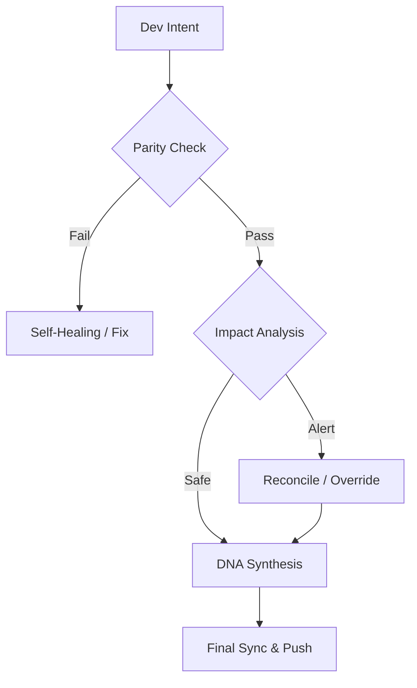

# Continuity Legacy v1.3.1: Cadre de Continuité Globale

#### Editions
[](https://github.com/SteveBlackbeard/CONTINUITY-LEGACY-by-Ethernium/blob/main/continuity-lite/) [](https://github.com/SteveBlackbeard/CONTINUITY-LEGACY-by-Ethernium/blob/main/continuity/) [](https://github.com/SteveBlackbeard/CONTINUITY-LEGACY-by-Ethernium/blob/main/continuity-omega/)

#### Languages
[](https://github.com/SteveBlackbeard/CONTINUITY-LEGACY-by-Ethernium/blob/main/OTHER_LANGUAGES/README_es.md) [](https://github.com/SteveBlackbeard/CONTINUITY-LEGACY-by-Ethernium/blob/main/README.md) [](https://github.com/SteveBlackbeard/CONTINUITY-LEGACY-by-Ethernium/blob/main/OTHER_LANGUAGES/README_ja.md) [](https://github.com/SteveBlackbeard/CONTINUITY-LEGACY-by-Ethernium/blob/main/OTHER_LANGUAGES/README_zh.md) [](https://github.com/SteveBlackbeard/CONTINUITY-LEGACY-by-Ethernium/blob/main/OTHER_LANGUAGES/README_ru.md) [](https://github.com/SteveBlackbeard/CONTINUITY-LEGACY-by-Ethernium/blob/main/OTHER_LANGUAGES/README_fr.md) [](https://github.com/SteveBlackbeard/CONTINUITY-LEGACY-by-Ethernium/blob/main/OTHER_LANGUAGES/README_it.md) [](https://github.com/SteveBlackbeard/CONTINUITY-LEGACY-by-Ethernium/blob/main/OTHER_LANGUAGES/README_de.md) [](https://github.com/SteveBlackbeard/CONTINUITY-LEGACY-by-Ethernium/blob/main/OTHER_LANGUAGES/README_pt.md)

[](https://github.com/SteveBlackbeard/CONTINUITY-LEGACY-by-Ethernium)
[](https://opensource.org/licenses/MIT)
[](https://www.python.org/)
[](https://github.com/SteveBlackbeard/CONTINUITY-LEGACY-by-Ethernium)
[](https://github.com/SteveBlackbeard/CONTINUITY-LEGACY-by-Ethernium)

**Continuity** est un cadre de synchronisation de qualité professionnelle conçu pour protéger la lignée logique de votre logiciel lors des transferts IA-Humain et IA-IA. Il garantit que l'intention de développement, les décisions architecturales et le contexte tactique ne soient jamais perdus.

---

## 🚀 Installation Rapide

```bash
# 1. Cloner le dépôt
git clone https://github.com/SteveBlackbeard/CONTINUITY-LEGACY-by-Ethernium.git
cd CONTINUITY-LEGACY-by-Ethernium

# 2. Installer l'Édition Lite (Recommandée pour un usage quotidien)
pip install -e continuity-lite

# 3. Configurer le Garde-frontière Git
python continuity-lite/run_continuity_lite.py --hook
```

---

## ⚡ Utilisation Minimale (Démarrage en 5 Lignes)

```python
# Exécutez simplement le gardien dans votre terminal
python continuity-lite/run_continuity_lite.py

# Sortie Attendue:
# [*] CONTINUITY LEGACY Lite - Validation ADN
# [] Parité Confirmée. Prêt pour un transfert sûr.
```

---

## 🔍 Le Flux de Qualité (Le Garde-frontière)

Continuity agit comme un "Pare-feu Socratique" pour votre projet. Voici comment votre intention de conception est protégée:



---

## 🏢 Choose Your Edition

[](../continuity-lite)

[](../continuity)

[](../continuity-omega)

### 🧠 Édition Omega: Perspicacité Cognitive *(En Développement)*
L'**édition Omega** est notre niveau de qualité entreprise. Elle fournit une lignée de décision visuelle et interactive et une analyse d'impact sémantique pour prévenir la dérive architecturale.


---

## 🌌 Origines: L'Héritage d'Ethernium

**Continuity Legacy** est né par nécessité au sein de l'**Écosystème Ethernium**—une vaste frontière en évolution de l'informatique cognitive et des systèmes autonomes. À mesure qu'Ethernium gagnait en complexité, le besoin de préserver l'état, l'intention et la lignée architecturale est devenu primordial.

Ce cadre est une extraction spécialisée de cet écosystème, affinée et durcie pour une utilisation autonome et prête pour la production. En utilisant Continuity, vous adoptez une pièce de la philosophie Ethernium: *état perpétuel, lignée ininterrompue et intégrité cognitive.*

---

## 🏷️ Mots-clés
`context-management`, `ai-memory`, `rag-framework`, `project-continuity`, `decision-logging`, `software-governance`

---
*Continuity: Protéger la lignée logique de votre logiciel.*