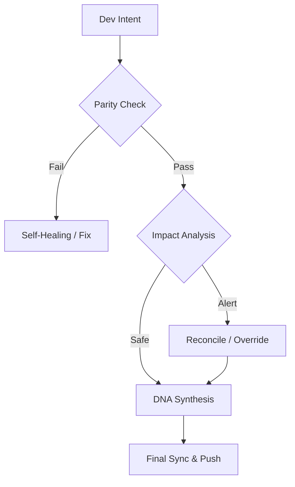

# Continuity Legacy v1.3.1: Framework di Continuità Globale

#### Languages
[](https://github.com/SteveBlackbeard/CONTINUITY-LEGACY-by-Ethernium/blob/main/OTHER_LANGUAGES/RELEASE_v1.3.1_es.md) [](https://github.com/SteveBlackbeard/CONTINUITY-LEGACY-by-Ethernium/blob/main/RELEASE_NOTES_MANIFEST.md) [](https://github.com/SteveBlackbeard/CONTINUITY-LEGACY-by-Ethernium/blob/main/OTHER_LANGUAGES/RELEASE_v1.3.1_ja.md) [](https://github.com/SteveBlackbeard/CONTINUITY-LEGACY-by-Ethernium/blob/main/OTHER_LANGUAGES/RELEASE_v1.3.1_zh.md) [](https://github.com/SteveBlackbeard/CONTINUITY-LEGACY-by-Ethernium/blob/main/OTHER_LANGUAGES/RELEASE_v1.3.1_ru.md) [](https://github.com/SteveBlackbeard/CONTINUITY-LEGACY-by-Ethernium/blob/main/OTHER_LANGUAGES/RELEASE_v1.3.1_fr.md) [](https://github.com/SteveBlackbeard/CONTINUITY-LEGACY-by-Ethernium/blob/main/OTHER_LANGUAGES/RELEASE_v1.3.1_it.md) [](https://github.com/SteveBlackbeard/CONTINUITY-LEGACY-by-Ethernium/blob/main/OTHER_LANGUAGES/RELEASE_v1.3.1_de.md) [](https://github.com/SteveBlackbeard/CONTINUITY-LEGACY-by-Ethernium/blob/main/OTHER_LANGUAGES/RELEASE_v1.3.1_pt.md)

[](https://github.com/SteveBlackbeard/CONTINUITY-LEGACY-by-Ethernium) [](https://opensource.org/licenses/MIT) [](https://www.python.org/) [](https://github.com/SteveBlackbeard/CONTINUITY-LEGACY-by-Ethernium) [](https://github.com/SteveBlackbeard/CONTINUITY-LEGACY-by-Ethernium/actions/workflows/global_sync.yml) [](https://github.com/SteveBlackbeard/CONTINUITY-LEGACY-by-Ethernium)

<p align="center">
<a href="https://github.com/SteveBlackbeard/CONTINUITY-LEGACY-by-Ethernium">

</a>
</p>

**Continuity** è un framework di sincronizzazione di livello professionale progettato per proteggere il lignaggio logico del software durante i passaggi IA-Umano e IA-IA. Garantisce che l'intento di sviluppo, le decisioni architetturali e il contesto tattico non vadano mai persi.

---

## 🏢 Scegli la tua Edizione

[](https://github.com/SteveBlackbeard/CONTINUITY-LEGACY-by-Ethernium/tree/main/continuity-lite)
<p align="center"><sub><b>Sincronizzazione locale minimalista con Sintesi del DNA per passaggi senza perdite.</b>: Sincronizzazione locale minimalista con Sintesi del DNA per passaggi senza perdite.</sub></p>

[](https://github.com/SteveBlackbeard/CONTINUITY-LEGACY-by-Ethernium/tree/main/continuity-pro)
<p align="center"><sub><b>Guardia di confine di nivel industriale con controlli di sicurezza e sincronizzazione globale.</b>: Guardia di confine di nivel industriale con controlli di sicurezza e sincronizzazione globale.</sub></p>

[](https://github.com/SteveBlackbeard/CONTINUITY-LEGACY-by-Ethernium/tree/main/continuity-omega)
<p align="center"><sub><b>RAG avanzato, mappatura cognitiva e analisi dell'impatto proattiva.</b>: RAG avanzato, mappatura cognitiva e analisi dell'impatto proattiva.</sub></p>

---

## 🚀 Installazione Rapida

```bash
# 1. Clonare il repository
git clone https://github.com/SteveBlackbeard/CONTINUITY-LEGACY-by-Ethernium.git
cd CONTINUITY-LEGACY-by-Ethernium

# 2. Installare l'Edizione Lite (Più consigliata per l'uso quotidiano)
pip install -e continuity-lite

# 3. Configurare la Guardia di Frontiera Git
python continuity-lite/run_continuity_lite.py --hook
```

---

## ⚡ Utilizzo Minimo (Inizio in 5 Linee)

```python
python continuity-lite/run_continuity_lite.py
```

---

## 🔍 Il Flusso di Qualità (La Guardia di Confine)



---

### 🧠 RAG avanzato, mappatura cognitiva e analisi dell'impatto proattiva. *(In development)*
The **Omega edition** is our Enterprise-grade Tier. It provides a visual, interactive decision lineage and semantic impact analysis to prevent architectural drift.

*OMEGA DASHBOARD VISUALIZATION (In Development)*

---

## 🌌 Origini: L’Eredità di Ethernium

**Continuity Legacy** è nato per necessità all'interno dell'**Ecosistema Ethernium**—una vasta frontiera in evoluzione del computing cognitivo e dei sistemi autonomi. Man mano che Ethernium cresceva in complessità, la necessità di preservare stato, intento e lignaggio architetturale è diventata fondamentale.

Questo framework è un'estrazione specializzata da quell'ecosistema, raffinata e temprata per un uso autonomo e pronto per la produzione. Usando Continuity, state adottando un pezzo della filosofia Ethernium: *stato perpetuo, lignaggio ininterrotto e integrità cognitiva.*

---

## 🏷️ Parole Chiave
`context-management`, `ai-memory`, `rag-framework`, `project-continuity`, `decision-logging`, `software-governance`

---
*Continuity: Proteggere la discendenza logica del software.*
