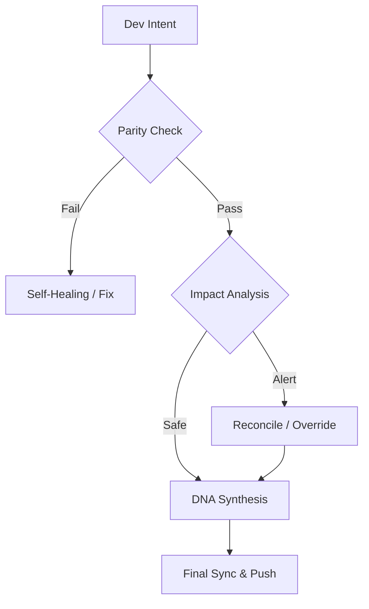

# Continuity Legacy v1.3.1: グローバル・コンティニュイティ・フレームワーク

#### Editions
[](https://github.com/SteveBlackbeard/CONTINUITY-LEGACY-by-Ethernium/blob/main/continuity-lite/) [](https://github.com/SteveBlackbeard/CONTINUITY-LEGACY-by-Ethernium/blob/main/continuity/) [](https://github.com/SteveBlackbeard/CONTINUITY-LEGACY-by-Ethernium/blob/main/continuity-omega/)

#### Languages
[](https://github.com/SteveBlackbeard/CONTINUITY-LEGACY-by-Ethernium/blob/main/OTHER_LANGUAGES/README_es.md) [](https://github.com/SteveBlackbeard/CONTINUITY-LEGACY-by-Ethernium/blob/main/README.md) [](https://github.com/SteveBlackbeard/CONTINUITY-LEGACY-by-Ethernium/blob/main/OTHER_LANGUAGES/README_ja.md) [](https://github.com/SteveBlackbeard/CONTINUITY-LEGACY-by-Ethernium/blob/main/OTHER_LANGUAGES/README_zh.md) [](https://github.com/SteveBlackbeard/CONTINUITY-LEGACY-by-Ethernium/blob/main/OTHER_LANGUAGES/README_ru.md) [](https://github.com/SteveBlackbeard/CONTINUITY-LEGACY-by-Ethernium/blob/main/OTHER_LANGUAGES/README_fr.md) [](https://github.com/SteveBlackbeard/CONTINUITY-LEGACY-by-Ethernium/blob/main/OTHER_LANGUAGES/README_it.md) [](https://github.com/SteveBlackbeard/CONTINUITY-LEGACY-by-Ethernium/blob/main/OTHER_LANGUAGES/README_de.md) [](https://github.com/SteveBlackbeard/CONTINUITY-LEGACY-by-Ethernium/blob/main/OTHER_LANGUAGES/README_pt.md)

[](https://github.com/SteveBlackbeard/CONTINUITY-LEGACY-by-Ethernium)
[](https://opensource.org/licenses/MIT)
[](https://www.python.org/)
[](https://github.com/SteveBlackbeard/CONTINUITY-LEGACY-by-Ethernium)
[](https://github.com/SteveBlackbeard/CONTINUITY-LEGACY-by-Ethernium)

**Continuity** は、AI-人間およびAI-AI間のハンドオフ時にソフトウェアの論理的系譜を保護するために設計されたプロフェッショナルグレードの同期フレームワークです。開発意図、アーキテクチャ上の決定、戦術的コンテキストが失われないことを保証します。

---

## 🚀 クイックインストール

```bash
# 1. リポジトリをクローン
git clone https://github.com/SteveBlackbeard/CONTINUITY-LEGACY-by-Ethernium.git
cd CONTINUITY-LEGACY-by-Ethernium

# 2. Lite エディションをインストール（日常使用に最適）
pip install -e continuity-lite

# 3. Git ボーダーガードを設定
python continuity-lite/run_continuity_lite.py --hook
```

---

## ⚡ 最小限の使用法（5行スタート）

```python
# ターミナルでガーディアンを実行するだけ
python continuity-lite/run_continuity_lite.py

# 予想される出力:
# [*] CONTINUITY LEGACY Lite - DNA検証
# [] パリティ確認済み。安全なハンドオフの準備完了。
```

---

## 🔍 品質フロー（ボーダーガード）

Continuityはプロジェクトの「ソクラテス的ファイアウォール」として機能します。設計意図がどのように保護されるかを示します：



---

## 🏢 エディションを選択

[](../continuity-lite)
<p align="center"><sub><b>Continuity Legacy Lite</b>: Minimal local sync.</sub></p>

[](../continuity)

[](../continuity-omega)
<p align="center"><sub><b>Continuity Legacy Omega</b>: Enterprise RAG oracle.</sub></p>

### 🧠 Omega エディション: 認知的洞察 *（開発中）*
**Omega エディション**はエンタープライズグレードのティアです。アーキテクチャのドリフトを防ぐための視覚的でインタラクティブな意思決定系譜とセマンティック影響分析を提供します。


---

## 🌌 起源: Etherniumの遺産

**Continuity Legacy** は **Ethernium エコシステム**内の必要性から生まれました—認知コンピューティングと自律システムの広大で進化する最前線です。Etherniumの複雑さが増すにつれ、状態、意図、アーキテクチャの系譜を保存する必要性が最も重要になりました。

このフレームワークはそのエコシステムから専門的に抽出され、スタンドアロンでプロダクションレディな使用のために洗練され強化されています。Continuityを使用することで、Etherniumの哲学を採用しています：*永続的な状態、途切れない系譜、認知的整合性。*

---

## 🏷️ キーワード
`context-management`, `ai-memory`, `rag-framework`, `project-continuity`, `decision-logging`, `software-governance`

---
*Continuity: ソフトウェアの論理的系譜を保護します。*