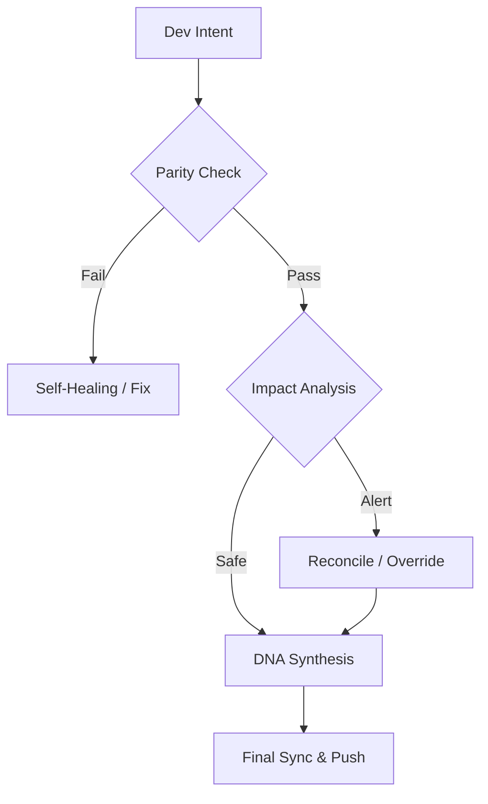

# Continuity Legacy v1.3.1: Framework de Continuidade Global

#### Editions
[](https://github.com/SteveBlackbeard/CONTINUITY-LEGACY-by-Ethernium/blob/main/continuity-lite/) [](https://github.com/SteveBlackbeard/CONTINUITY-LEGACY-by-Ethernium/blob/main/continuity/) [](https://github.com/SteveBlackbeard/CONTINUITY-LEGACY-by-Ethernium/blob/main/continuity-omega/)

#### Languages
[](https://github.com/SteveBlackbeard/CONTINUITY-LEGACY-by-Ethernium/blob/main/OTHER_LANGUAGES/README_es.md) [](https://github.com/SteveBlackbeard/CONTINUITY-LEGACY-by-Ethernium/blob/main/README.md) [](https://github.com/SteveBlackbeard/CONTINUITY-LEGACY-by-Ethernium/blob/main/OTHER_LANGUAGES/README_ja.md) [](https://github.com/SteveBlackbeard/CONTINUITY-LEGACY-by-Ethernium/blob/main/OTHER_LANGUAGES/README_zh.md) [](https://github.com/SteveBlackbeard/CONTINUITY-LEGACY-by-Ethernium/blob/main/OTHER_LANGUAGES/README_ru.md) [](https://github.com/SteveBlackbeard/CONTINUITY-LEGACY-by-Ethernium/blob/main/OTHER_LANGUAGES/README_fr.md) [](https://github.com/SteveBlackbeard/CONTINUITY-LEGACY-by-Ethernium/blob/main/OTHER_LANGUAGES/README_it.md) [](https://github.com/SteveBlackbeard/CONTINUITY-LEGACY-by-Ethernium/blob/main/OTHER_LANGUAGES/README_de.md) [](https://github.com/SteveBlackbeard/CONTINUITY-LEGACY-by-Ethernium/blob/main/OTHER_LANGUAGES/README_pt.md)

[](https://github.com/SteveBlackbeard/CONTINUITY-LEGACY-by-Ethernium)
[](https://opensource.org/licenses/MIT)
[](https://www.python.org/)
[](https://github.com/SteveBlackbeard/CONTINUITY-LEGACY-by-Ethernium)
[](https://github.com/SteveBlackbeard/CONTINUITY-LEGACY-by-Ethernium)

**Continuity** é um framework de sincronização de nível profissional projetado para proteger a linhagem lógica do seu software durante transferências IA-Humano e IA-IA. Garante que a intenção de desenvolvimento, decisões arquitetônicas e contexto tático nunca se percam.

---

## 🚀 Instalação Rápida

```bash
# 1. Clonar o repositório
git clone https://github.com/SteveBlackbeard/CONTINUITY-LEGACY-by-Ethernium.git
cd CONTINUITY-LEGACY-by-Ethernium

# 2. Instalar a Edição Lite (Mais recomendada para uso diário)
pip install -e continuity-lite

# 3. Configurar o Guarda de Fronteira Git
python continuity-lite/run_continuity_lite.py --hook
```

---

## ⚡ Uso Mínimo (Início em 5 Linhas)

```python
# Simplesmente execute o guardião no seu terminal
python continuity-lite/run_continuity_lite.py

# Saída Esperada:
# [*] CONTINUITY LEGACY Lite - Validação de DNA
# [] Paridade Confirmada. Pronto para transferência segura.
```

---

## 🔍 O Fluxo de Qualidade (O Guarda de Fronteira)

Continuity atua como um "Firewall Socrático" para o seu projeto. Veja como a sua intenção de design é protegida:



---

## 🏢 Choose Your Edition

[](../continuity-lite)
<p align="center"><sub><b>Continuity Legacy Lite</b>: Sincronización mínima local con síntesis de ADN.</sub></p>

[](../continuity)
<p align="center"><sub><b>Continuity Legacy Pro</b>: Guardia fronterizo de grado industrial.</sub></p>

[](../continuity-omega)
<p align="center"><sub><b>Continuity Legacy Omega</b>: RAG avanzado y análisis de impacto proactivo.</sub></p>

### 🧠 Edição Omega: Perspicácia Cognitiva *(Em Desenvolvimento)*
A **edição Omega** é o nosso nível Enterprise. Fornece uma linhagem de decisão visual e interativa e análise de impacto semântico para prevenir a deriva arquitetônica.


---

## 🌌 Origens: A Herança do Ethernium

**Continuity Legacy** nasceu por necessidade dentro do **Ecossistema Ethernium**—uma vasta fronteira em evolução da computação cognitiva e sistemas autônomos. À medida que o Ethernium crescia em complexidade, a necessidade de preservar estado, intenção e linhagem arquitetônica tornou-se primordial.

Este framework é uma extração especializada desse ecossistema, refinada e endurecida para uso autônomo e pronto para produção. Ao usar Continuity, você está adotando uma peça da filosofia Ethernium: *estado perpétuo, linhagem inquebrável e integridade cognitiva.*

---

## 🏷️ Palavras-chave
`context-management`, `ai-memory`, `rag-framework`, `project-continuity`, `decision-logging`, `software-governance`

---
*Continuity: Protegendo a linhagem lógica do seu software.*