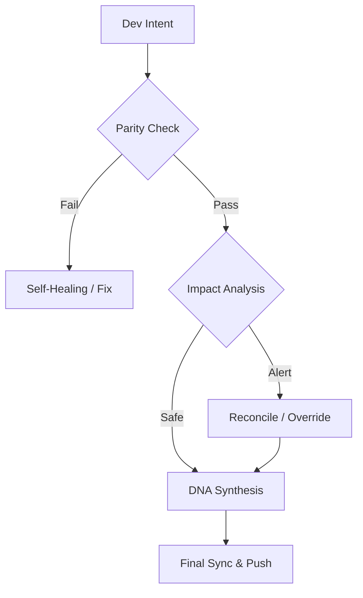

#### Languages
[](https://github.com/SteveBlackbeard/CONTINUITY-LEGACY-by-Ethernium/blob/main/OTHER_LANGUAGES/RELEASE_v1.3.1_es.md) [](https://github.com/SteveBlackbeard/CONTINUITY-LEGACY-by-Ethernium/blob/main/RELEASE_NOTES_MANIFEST.md) [](https://github.com/SteveBlackbeard/CONTINUITY-LEGACY-by-Ethernium/blob/main/OTHER_LANGUAGES/RELEASE_v1.3.1_ja.md) [](https://github.com/SteveBlackbeard/CONTINUITY-LEGACY-by-Ethernium/blob/main/OTHER_LANGUAGES/RELEASE_v1.3.1_zh.md) [](https://github.com/SteveBlackbeard/CONTINUITY-LEGACY-by-Ethernium/blob/main/OTHER_LANGUAGES/RELEASE_v1.3.1_ru.md) [](https://github.com/SteveBlackbeard/CONTINUITY-LEGACY-by-Ethernium/blob/main/OTHER_LANGUAGES/RELEASE_v1.3.1_fr.md) [](https://github.com/SteveBlackbeard/CONTINUITY-LEGACY-by-Ethernium/blob/main/OTHER_LANGUAGES/RELEASE_v1.3.1_it.md) [](https://github.com/SteveBlackbeard/CONTINUITY-LEGACY-by-Ethernium/blob/main/OTHER_LANGUAGES/RELEASE_v1.3.1_de.md) [](https://github.com/SteveBlackbeard/CONTINUITY-LEGACY-by-Ethernium/blob/main/OTHER_LANGUAGES/RELEASE_v1.3.1_pt.md)

[](https://github.com/SteveBlackbeard/CONTINUITY-LEGACY-by-Ethernium) [](https://opensource.org/licenses/MIT) [](https://www.python.org/) [](https://github.com/SteveBlackbeard/CONTINUITY-LEGACY-by-Ethernium) [](https://github.com/SteveBlackbeard/CONTINUITY-LEGACY-by-Ethernium/actions/workflows/global_sync.yml) [](https://github.com/SteveBlackbeard/CONTINUITY-LEGACY-by-Ethernium)

<p align="center">
<a href="https://github.com/SteveBlackbeard/CONTINUITY-LEGACY-by-Ethernium">

</a>
</p>

# Continuity Legacy v1.3.1: Глобальный фреймворк непрерывности

Continuity is now structured into three specialized editions to provide the right level of governance for every project:

[](https://github.com/SteveBlackbeard/CONTINUITY-LEGACY-by-Ethernium/blob/main/continuity-lite/)
[](https://github.com/SteveBlackbeard/CONTINUITY-LEGACY-by-Ethernium/blob/main/continuity-pro/)
[](https://github.com/SteveBlackbeard/CONTINUITY-LEGACY-by-Ethernium/blob/main/continuity-omega/)


#### Languages
[](https://github.com/SteveBlackbeard/CONTINUITY-LEGACY-by-Ethernium/blob/main/OTHER_LANGUAGES/README_es.md) [](https://github.com/SteveBlackbeard/CONTINUITY-LEGACY-by-Ethernium/blob/main/README.md) [](https://github.com/SteveBlackbeard/CONTINUITY-LEGACY-by-Ethernium/blob/main/OTHER_LANGUAGES/README_ja.md) [](https://github.com/SteveBlackbeard/CONTINUITY-LEGACY-by-Ethernium/blob/main/OTHER_LANGUAGES/README_zh.md) [](https://github.com/SteveBlackbeard/CONTINUITY-LEGACY-by-Ethernium/blob/main/OTHER_LANGUAGES/README_ru.md) [](https://github.com/SteveBlackbeard/CONTINUITY-LEGACY-by-Ethernium/blob/main/OTHER_LANGUAGES/README_fr.md) [](https://github.com/SteveBlackbeard/CONTINUITY-LEGACY-by-Ethernium/blob/main/OTHER_LANGUAGES/README_it.md) [](https://github.com/SteveBlackbeard/CONTINUITY-LEGACY-by-Ethernium/blob/main/OTHER_LANGUAGES/README_de.md) [](https://github.com/SteveBlackbeard/CONTINUITY-LEGACY-by-Ethernium/blob/main/OTHER_LANGUAGES/README_pt.md)

[](https://github.com/SteveBlackbeard/CONTINUITY-LEGACY-by-Ethernium)
[](https://opensource.org/licenses/MIT)
[](https://www.python.org/)
[](https://github.com/SteveBlackbeard/CONTINUITY-LEGACY-by-Ethernium)
[](https://github.com/SteveBlackbeard/CONTINUITY-LEGACY-by-Ethernium)

**Continuity** — это профессиональный фреймворк синхронизации, предназначенный для защиты логической родословной вашего программного обеспечения при передаче между ИИ и человеком, а также между ИИ. Он гарантирует, что намерение разработки, архитектурные решения и тактический контекст никогда не будут потеряны.


## 🏢 Выберите вашу редакцию

[](https://github.com/SteveBlackbeard/CONTINUITY-LEGACY-by-Ethernium/tree/main/continuity-lite)
<p align="center"><sub><b>Continuity Legacy Lite — Хранитель нулевого трения</b>: Минималистичная локальная синхронизация с синтезом ДНК для передачи без потерь.</sub></p>

[](https://github.com/SteveBlackbeard/CONTINUITY-LEGACY-by-Ethernium/tree/main/continuity-pro)
<p align="center"><sub><b>Continuity Legacy Pro — Тактический двигатель</b>: Пограничный контроль промышленного уровня с аудитом безопасности и глобальной синхронизацией.</sub></p>

[](https://github.com/SteveBlackbeard/CONTINUITY-LEGACY-by-Ethernium/tree/main/continuity-omega)
<p align="center"><sub><b>Continuity Legacy Omega — Корпоративный оракул</b>: Продвинутый RAG, когнитивное картирование и проактивный анализ воздействия.</sub></p>

---


## 🚀 Быстрая Установка

```bash
# 1. Клонировать репозиторий
git clone https://github.com/SteveBlackbeard/CONTINUITY-LEGACY-by-Ethernium.git
cd CONTINUITY-LEGACY-by-Ethernium

# 2. Установить Lite-издание (Рекомендуется для ежедневного использования)
pip install -e continuity-lite

# 3. Настроить пограничный контроль Git
python continuity-lite/run_continuity_lite.py --hook
```

---

## ⚡ Минимальное Использование (Старт в 5 Строк)

```python
# Просто запустите стража в терминале
python continuity-lite/run_continuity_lite.py

# Ожидаемый вывод:
# [*] CONTINUITY LEGACY Lite - Валидация ДНК
# [] Паритет Подтверждён. Готов к безопасной передаче.
```

---

## 🔍 Поток Качества (Пограничный Страж)

Continuity действует как «Сократовский Фаервол» для вашего проекта. Вот как защищается ваше проектное намерение:



---

### 🧠 Издание Omega: Когнитивное Прозрение *(В Разработке)*
**Издание Omega** — наш уровень корпоративного класса. Оно обеспечивает визуальную, интерактивную родословную решений и семантический анализ воздействия для предотвращения архитектурного дрейфа.


---

## 🌌 Происхождение: Наследие Ethernium

**Continuity Legacy** родился из необходимости внутри **Экосистемы Ethernium** — обширного, развивающегося рубежа когнитивных вычислений и автономных систем. По мере роста сложности Ethernium необходимость сохранения состояния, намерения и архитектурной родословной стала первостепенной.

Этот фреймворк является специализированной экстракцией из этой экосистемы, доработанной и закалённой для автономного, готового к производству использования. Используя Continuity, вы принимаете часть философии Ethernium: *вечное состояние, непрерывная родословная и когнитивная целостность.*

---

## 🏷️ Ключевые Слова
`context-management`, `ai-memory`, `rag-framework`, `project-continuity`, `decision-logging`, `software-governance`

---
*Continuity: Защита логической родословной вашего программного обеспечения.*
