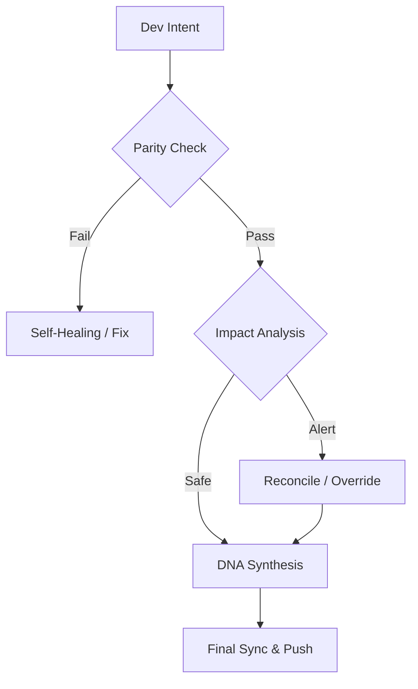

# Continuity Legacy v1.3.1: Глобальный Фреймворк Непрерывности

#### Editions
[](https://github.com/SteveBlackbeard/CONTINUITY-LEGACY-by-Ethernium/blob/main/continuity-lite/) [](https://github.com/SteveBlackbeard/CONTINUITY-LEGACY-by-Ethernium/blob/main/continuity/) [](https://github.com/SteveBlackbeard/CONTINUITY-LEGACY-by-Ethernium/blob/main/continuity-omega/)

#### Languages
[](https://github.com/SteveBlackbeard/CONTINUITY-LEGACY-by-Ethernium/blob/main/OTHER_LANGUAGES/README_es.md) [](https://github.com/SteveBlackbeard/CONTINUITY-LEGACY-by-Ethernium/blob/main/README.md) [](https://github.com/SteveBlackbeard/CONTINUITY-LEGACY-by-Ethernium/blob/main/OTHER_LANGUAGES/README_ja.md) [](https://github.com/SteveBlackbeard/CONTINUITY-LEGACY-by-Ethernium/blob/main/OTHER_LANGUAGES/README_zh.md) [](https://github.com/SteveBlackbeard/CONTINUITY-LEGACY-by-Ethernium/blob/main/OTHER_LANGUAGES/README_ru.md) [](https://github.com/SteveBlackbeard/CONTINUITY-LEGACY-by-Ethernium/blob/main/OTHER_LANGUAGES/README_fr.md) [](https://github.com/SteveBlackbeard/CONTINUITY-LEGACY-by-Ethernium/blob/main/OTHER_LANGUAGES/README_it.md) [](https://github.com/SteveBlackbeard/CONTINUITY-LEGACY-by-Ethernium/blob/main/OTHER_LANGUAGES/README_de.md) [](https://github.com/SteveBlackbeard/CONTINUITY-LEGACY-by-Ethernium/blob/main/OTHER_LANGUAGES/README_pt.md)

[](https://github.com/SteveBlackbeard/CONTINUITY-LEGACY-by-Ethernium)
[](https://opensource.org/licenses/MIT)
[](https://www.python.org/)
[](https://github.com/SteveBlackbeard/CONTINUITY-LEGACY-by-Ethernium)
[](https://github.com/SteveBlackbeard/CONTINUITY-LEGACY-by-Ethernium)

**Continuity** — это профессиональный фреймворк синхронизации, предназначенный для защиты логической родословной вашего программного обеспечения при передаче между ИИ и человеком, а также между ИИ. Он гарантирует, что намерение разработки, архитектурные решения и тактический контекст никогда не будут потеряны.

---

## 🚀 Быстрая Установка

```bash
# 1. Клонировать репозиторий
git clone https://github.com/SteveBlackbeard/CONTINUITY-LEGACY-by-Ethernium.git
cd CONTINUITY-LEGACY-by-Ethernium

# 2. Установить Lite-издание (Рекомендуется для ежедневного использования)
pip install -e continuity-lite

# 3. Настроить пограничный контроль Git
python continuity-lite/run_continuity_lite.py --hook
```

---

## ⚡ Минимальное Использование (Старт в 5 Строк)

```python
# Просто запустите стража в терминале
python continuity-lite/run_continuity_lite.py

# Ожидаемый вывод:
# [*] CONTINUITY LEGACY Lite - Валидация ДНК
# [] Паритет Подтверждён. Готов к безопасной передаче.
```

---

## 🔍 Поток Качества (Пограничный Страж)

Continuity действует как «Сократовский Фаервол» для вашего проекта. Вот как защищается ваше проектное намерение:



---

## 🏢 Choose Your Edition

[](../continuity-lite)
<p align="center"><sub><b>Continuity Legacy Lite</b>: Sincronización mínima local con síntesis de ADN.</sub></p>

[](../continuity)
<p align="center"><sub><b>Continuity Legacy Pro</b>: Guardia fronterizo de grado industrial.</sub></p>

[](../continuity-omega)
<p align="center"><sub><b>Continuity Legacy Omega</b>: RAG avanzado y análisis de impacto proactivo.</sub></p>

### 🧠 Издание Omega: Когнитивное Прозрение *(В Разработке)*
**Издание Omega** — наш уровень корпоративного класса. Оно обеспечивает визуальную, интерактивную родословную решений и семантический анализ воздействия для предотвращения архитектурного дрейфа.


---

## 🌌 Происхождение: Наследие Ethernium

**Continuity Legacy** родился из необходимости внутри **Экосистемы Ethernium** — обширного, развивающегося рубежа когнитивных вычислений и автономных систем. По мере роста сложности Ethernium необходимость сохранения состояния, намерения и архитектурной родословной стала первостепенной.

Этот фреймворк является специализированной экстракцией из этой экосистемы, доработанной и закалённой для автономного, готового к производству использования. Используя Continuity, вы принимаете часть философии Ethernium: *вечное состояние, непрерывная родословная и когнитивная целостность.*

---

## 🏷️ Ключевые Слова
`context-management`, `ai-memory`, `rag-framework`, `project-continuity`, `decision-logging`, `software-governance`

---
*Continuity: Защита логической родословной вашего программного обеспечения.*