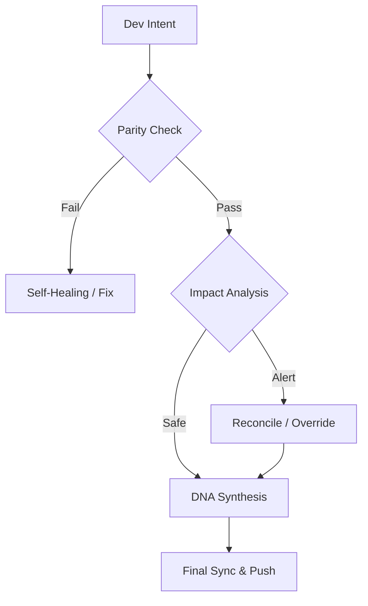

# Continuity Legacy v2.1.0: 全球连续性框架

#### Languages
[](https://github.com/SteveBlackbeard/CONTINUITY-LEGACY-by-Ethernium/blob/main/OTHER_LANGUAGES/RELEASE_v2.1.0_es.md) [](https://github.com/SteveBlackbeard/CONTINUITY-LEGACY-by-Ethernium/blob/main/RELEASE_NOTES_MANIFEST.md) [](https://github.com/SteveBlackbeard/CONTINUITY-LEGACY-by-Ethernium/blob/main/OTHER_LANGUAGES/RELEASE_v2.1.0_ja.md) [](https://github.com/SteveBlackbeard/CONTINUITY-LEGACY-by-Ethernium/blob/main/OTHER_LANGUAGES/RELEASE_v2.1.0_zh.md) [](https://github.com/SteveBlackbeard/CONTINUITY-LEGACY-by-Ethernium/blob/main/OTHER_LANGUAGES/RELEASE_v2.1.0_ru.md) [](https://github.com/SteveBlackbeard/CONTINUITY-LEGACY-by-Ethernium/blob/main/OTHER_LANGUAGES/RELEASE_v2.1.0_fr.md) [](https://github.com/SteveBlackbeard/CONTINUITY-LEGACY-by-Ethernium/blob/main/OTHER_LANGUAGES/RELEASE_v2.1.0_it.md) [](https://github.com/SteveBlackbeard/CONTINUITY-LEGACY-by-Ethernium/blob/main/OTHER_LANGUAGES/RELEASE_v2.1.0_de.md) [](https://github.com/SteveBlackbeard/CONTINUITY-LEGACY-by-Ethernium/blob/main/OTHER_LANGUAGES/RELEASE_v2.1.0_pt.md)

[](https://github.com/SteveBlackbeard/CONTINUITY-LEGACY-by-Ethernium) [](https://opensource.org/licenses/MIT) [](https://www.python.org/) [](https://github.com/SteveBlackbeard/CONTINUITY-LEGACY-by-Ethernium) [](https://github.com/SteveBlackbeard/CONTINUITY-LEGACY-by-Ethernium/actions/workflows/global_sync.yml) [](https://github.com/SteveBlackbeard/CONTINUITY-LEGACY-by-Ethernium)

<p align="center">
<a href="https://github.com/SteveBlackbeard/CONTINUITY-LEGACY-by-Ethernium">

</a>
</p>

**Continuity** 是一个专业级同步框架，旨在在AI-人类和AI-AI交接过程中保护软件的逻辑谱系。它确保开发意图、架构决策和战术上下文永不丢失。

---

## 🏢 选择您的版本

[](https://github.com/SteveBlackbeard/CONTINUITY-LEGACY-by-Ethernium/tree/main/continuity-lite)
<p align="center"><sub><b>具有DNA合成功能的极简本地同步，实现无损交接。</b>: 具有DNA合成功能的极简本地同步，实现无损交接。</sub></p>

[](https://github.com/SteveBlackbeard/CONTINUITY-LEGACY-by-Ethernium/tree/main/continuity-pro)
<p align="center"><sub><b>具有安全审计和全球同步功能的工业级边界守卫。</b>: 具有安全审计和全球同步功能的工业级边界守卫。</sub></p>

[](https://github.com/SteveBlackbeard/CONTINUITY-LEGACY-by-Ethernium/tree/main/continuity-omega)
<p align="center"><sub><b>高级RAG，认知映射和主动影响分析。</b>: 高级RAG，认知映射和主动影响分析。</sub></p>

---

## 🚀 快速安装

```bash
# Run the DNA validation cycle
continuity-lite
```

---

## 🔍 质量流（边界守卫）



---

### 🧠 高级RAG，认知映射和主动影响分析。 *(In development)*
The **Omega edition** is our Enterprise-grade Tier. It provides a visual, interactive decision lineage and semantic impact analysis to prevent architectural drift.

*OMEGA DASHBOARD VISUALIZATION (In Development)*

---

## 🌌 起源：Ethernium的传承

---

---

## 🏷️ 关键词
`context-management`, `ai-memory`, `rag-framework`, `project-continuity`, `decision-logging`, `software-governance`

---
*Continuity：保护软件的逻辑血统。*
