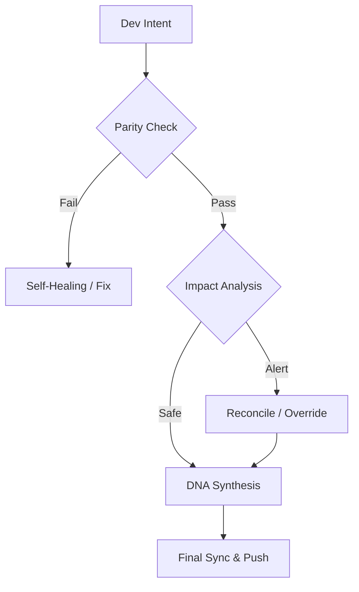

# Continuity Legacy v1.3.1: 全球连续性框架

#### Editions
[](https://github.com/SteveBlackbeard/CONTINUITY-LEGACY-by-Ethernium/blob/main/continuity-lite/) [](https://github.com/SteveBlackbeard/CONTINUITY-LEGACY-by-Ethernium/blob/main/continuity/) [](https://github.com/SteveBlackbeard/CONTINUITY-LEGACY-by-Ethernium/blob/main/continuity-omega/)

#### Languages
[](https://github.com/SteveBlackbeard/CONTINUITY-LEGACY-by-Ethernium/blob/main/OTHER_LANGUAGES/README_es.md) [](https://github.com/SteveBlackbeard/CONTINUITY-LEGACY-by-Ethernium/blob/main/README.md) [](https://github.com/SteveBlackbeard/CONTINUITY-LEGACY-by-Ethernium/blob/main/OTHER_LANGUAGES/README_ja.md) [](https://github.com/SteveBlackbeard/CONTINUITY-LEGACY-by-Ethernium/blob/main/OTHER_LANGUAGES/README_zh.md) [](https://github.com/SteveBlackbeard/CONTINUITY-LEGACY-by-Ethernium/blob/main/OTHER_LANGUAGES/README_ru.md) [](https://github.com/SteveBlackbeard/CONTINUITY-LEGACY-by-Ethernium/blob/main/OTHER_LANGUAGES/README_fr.md) [](https://github.com/SteveBlackbeard/CONTINUITY-LEGACY-by-Ethernium/blob/main/OTHER_LANGUAGES/README_it.md) [](https://github.com/SteveBlackbeard/CONTINUITY-LEGACY-by-Ethernium/blob/main/OTHER_LANGUAGES/README_de.md) [](https://github.com/SteveBlackbeard/CONTINUITY-LEGACY-by-Ethernium/blob/main/OTHER_LANGUAGES/README_pt.md)

[](https://github.com/SteveBlackbeard/CONTINUITY-LEGACY-by-Ethernium)
[](https://opensource.org/licenses/MIT)
[](https://www.python.org/)
[](https://github.com/SteveBlackbeard/CONTINUITY-LEGACY-by-Ethernium)
[](https://github.com/SteveBlackbeard/CONTINUITY-LEGACY-by-Ethernium)

**Continuity** 是一个专业级同步框架，旨在在AI-人类和AI-AI交接过程中保护软件的逻辑谱系。它确保开发意图、架构决策和战术上下文永不丢失。

---

## 🚀 快速安装

```bash
# 1. 克隆仓库
git clone https://github.com/SteveBlackbeard/CONTINUITY-LEGACY-by-Ethernium.git
cd CONTINUITY-LEGACY-by-Ethernium

# 2. 安装 Lite 版本（最推荐日常使用）
pip install -e continuity-lite

# 3. 设置 Git 边境守卫
python continuity-lite/run_continuity_lite.py --hook
```

---

## ⚡ 最简使用（5行启动）

```python
# 只需在终端运行守护程序
python continuity-lite/run_continuity_lite.py

# 预期输出:
# [*] CONTINUITY LEGACY Lite - DNA验证
# [] 校验确认。准备安全交接。
```

---

## 🔍 质量流程（边境守卫）

Continuity 充当项目的'苏格拉底防火墙'。以下展示了您的设计意图如何被保护：



---

## 🏢 选择您的版本

[](../continuity-lite)
<p align="center"><sub><b>Continuity Legacy Lite</b>: Minimal local sync.</sub></p>

[](../continuity)

[](../continuity-omega)
<p align="center"><sub><b>Continuity Legacy Omega</b>: Enterprise RAG oracle.</sub></p>

### 🧠 Omega 版本：认知洞察 *（开发中）*
**Omega 版本**是我们的企业级层。它提供可视化、交互式的决策谱系和语义影响分析，以防止架构漂移。


---

## 🌌 起源：Ethernium 遗产

**Continuity Legacy** 源于 **Ethernium 生态系统**内的迫切需求——一个庞大的、不断演进的认知计算和自主系统前沿。随着 Ethernium 复杂性的增长，保存状态、意图和架构谱系的需求变得至关重要。

此框架是从该生态系统中专门提取的，经过精炼和强化，可用于独立的生产级部署。通过使用 Continuity，您正在采纳 Ethernium 哲学的一部分：*永恒状态、不间断谱系和认知完整性。*

---

## 🏷️ 关键词
`context-management`, `ai-memory`, `rag-framework`, `project-continuity`, `decision-logging`, `software-governance`

---
*Continuity：保护您软件的逻辑谱系。*