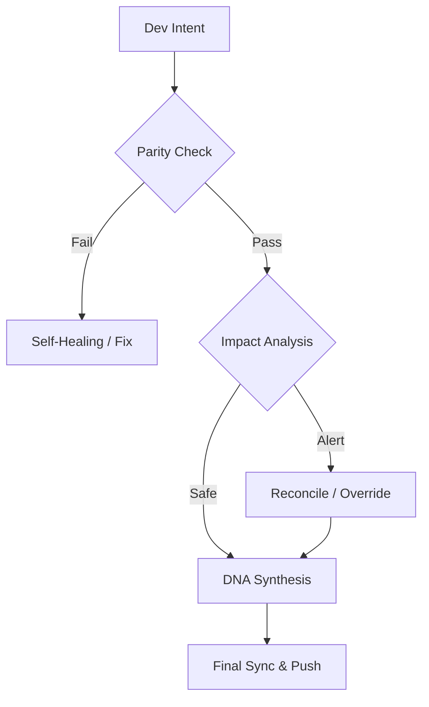

# Continuity Legacy v1.3.1 : Cadre de Continuité Global

#### Languages
[](https://github.com/SteveBlackbeard/CONTINUITY-LEGACY-by-Ethernium/blob/main/OTHER_LANGUAGES/RELEASE_v1.3.1_es.md) [](https://github.com/SteveBlackbeard/CONTINUITY-LEGACY-by-Ethernium/blob/main/RELEASE_NOTES_MANIFEST.md) [](https://github.com/SteveBlackbeard/CONTINUITY-LEGACY-by-Ethernium/blob/main/OTHER_LANGUAGES/RELEASE_v1.3.1_ja.md) [](https://github.com/SteveBlackbeard/CONTINUITY-LEGACY-by-Ethernium/blob/main/OTHER_LANGUAGES/RELEASE_v1.3.1_zh.md) [](https://github.com/SteveBlackbeard/CONTINUITY-LEGACY-by-Ethernium/blob/main/OTHER_LANGUAGES/RELEASE_v1.3.1_ru.md) [](https://github.com/SteveBlackbeard/CONTINUITY-LEGACY-by-Ethernium/blob/main/OTHER_LANGUAGES/RELEASE_v1.3.1_fr.md) [](https://github.com/SteveBlackbeard/CONTINUITY-LEGACY-by-Ethernium/blob/main/OTHER_LANGUAGES/RELEASE_v1.3.1_it.md) [](https://github.com/SteveBlackbeard/CONTINUITY-LEGACY-by-Ethernium/blob/main/OTHER_LANGUAGES/RELEASE_v1.3.1_de.md) [](https://github.com/SteveBlackbeard/CONTINUITY-LEGACY-by-Ethernium/blob/main/OTHER_LANGUAGES/RELEASE_v1.3.1_pt.md)

[](https://github.com/SteveBlackbeard/CONTINUITY-LEGACY-by-Ethernium) [](https://opensource.org/licenses/MIT) [](https://www.python.org/) [](https://github.com/SteveBlackbeard/CONTINUITY-LEGACY-by-Ethernium) [](https://github.com/SteveBlackbeard/CONTINUITY-LEGACY-by-Ethernium/actions/workflows/global_sync.yml) [](https://github.com/SteveBlackbeard/CONTINUITY-LEGACY-by-Ethernium)

<p align="center">
<a href="https://github.com/SteveBlackbeard/CONTINUITY-LEGACY-by-Ethernium">

</a>
</p>


---

## 🏢 Choisissez votre Édition

[](https://github.com/SteveBlackbeard/CONTINUITY-LEGACY-by-Ethernium/tree/main/continuity-lite)
<p align="center"><sub><b>Synchronisation locale minimaliste avec Synthèse d'ADN pour des transferts sans perte.</b>: Synchronisation locale minimaliste avec Synthèse d'ADN pour des transferts sans perte.</sub></p>

[](https://github.com/SteveBlackbeard/CONTINUITY-LEGACY-by-Ethernium/tree/main/continuity-pro)
<p align="center"><sub><b>Garde-frontière de niveau industriel avec audits de sécurité et synchronisation mondiale.</b>: Garde-frontière de niveau industriel avec audits de sécurité et synchronisation mondiale.</sub></p>

[](https://github.com/SteveBlackbeard/CONTINUITY-LEGACY-by-Ethernium/tree/main/continuity-omega)
<p align="center"><sub><b>RAG avancé, cartographie cognitive et analyse d'impact proactive.</b>: RAG avancé, cartographie cognitive et analyse d'impact proactive.</sub></p>

---

## 🚀 Installation Rapide

```bash
# 1. Cloner le dépôt
git clone https://github.com/SteveBlackbeard/CONTINUITY-LEGACY-by-Ethernium.git
cd CONTINUITY-LEGACY-by-Ethernium
# 2. Installer l'édition Lite
pip install -e continuity-lite
# 3. Configurer le Hook
python continuity-lite/run_continuity_lite.py --hook
```

---

## ⚡ Utilisation Minimale (Démarrage en 5 Lignes)

```python
python continuity-lite/run_continuity_lite.py
```

---

## 🔍 Le Flux de Qualité (Le Garde-Frontière)



---

### 🧠 RAG avancé, cartographie cognitive et analyse d'impact proactive. *(In development)*
The **Omega edition** is our Enterprise-grade Tier. It provides a visual, interactive decision lineage and semantic impact analysis to prevent architectural drift.

*OMEGA DASHBOARD VISUALIZATION (In Development)*

---

## 🌌 Origines : L’Héritage d’Ethernium

---

---

## 🏷️ Mots-clés
`context-management`, `ai-memory`, `rag-framework`, `project-continuity`, `decision-logging`, `software-governance`

---
*Continuity : Protéger la lignée logique de votre logiciel.*
