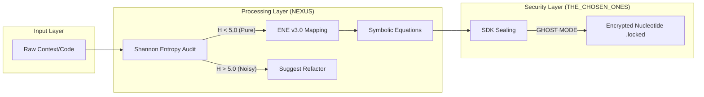

<p align="center">
  
</p>

# Continuity Legacy: Persistent Cognitive Layer

[](https://github.com/SteveBlackbeard/CONTINUITY-LEGACY-by-Ethernium/actions/workflows/industrial_guardian.yml)
[](https://github.com/SteveBlackbeard/CONTINUITY-LEGACY-by-Ethernium/releases)
[](https://github.com/SteveBlackbeard/CONTINUITY-LEGACY-by-Ethernium/blob/main/LICENSE)
[](https://www.python.org/downloads/release/python-3100/)

#### Languages
[](https://github.com/SteveBlackbeard/CONTINUITY-LEGACY-by-Ethernium/blob/main/OTHER_LANGUAGES/README_es.md) [](https://github.com/SteveBlackbeard/CONTINUITY-LEGACY-by-Ethernium/README.md) [](https://github.com/SteveBlackbeard/CONTINUITY-LEGACY-by-Ethernium/blob/main/OTHER_LANGUAGES/README_ja.md) [](https://github.com/SteveBlackbeard/CONTINUITY-LEGACY-by-Ethernium/blob/main/OTHER_LANGUAGES/README_zh.md) [](https://github.com/SteveBlackbeard/CONTINUITY-LEGACY-by-Ethernium/blob/main/OTHER_LANGUAGES/README_ru.md) [](https://github.com/SteveBlackbeard/CONTINUITY-LEGACY-by-Ethernium/blob/main/OTHER_LANGUAGES/README_fr.md) [](https://github.com/SteveBlackbeard/CONTINUITY-LEGACY-by-Ethernium/blob/main/OTHER_LANGUAGES/README_it.md) [](https://github.com/SteveBlackbeard/CONTINUITY-LEGACY-by-Ethernium/blob/main/OTHER_LANGUAGES/README_de.md) [](https://github.com/SteveBlackbeard/CONTINUITY-LEGACY-by-Ethernium/blob/main/OTHER_LANGUAGES/README_pt.md)

"**AI doesn't forget anymore.**"

*This prevents LLMs from losing context and destroying your codebase, mathematically forcing them to align with a cryptographic hash.*

---

## Enterprise Use Cases
Continuity Legacy solves the "Semantic Drift" in long-term AI-Human collaboration:
1. **Cross-Agent Handoffs**: Transfer full project context between different AI models (GPT-4 to Claude to local LLMs) with zero context loss.
2. **Multi-Day RAG Stability**: Ensures that Retrieval-Augmented Generation systems always point to the canonical source of truth, even after system resets.
3. **Legacy Restoration**: Instantly reconstruct the architectural intent of a project years after the last human developer has left.

---

## 30-Second Quickstart (Professional Onboarding)
Get the entire Ethernium Continuity Ecosystem running in seconds:

```bash
# Install the unified metapackage
pip install continuity-legacy

# Initialize the Guardian DNA in your current project
continuity init

# Verify state consistency
continuity status

# [NEW] Audit project cognitive weight (tokens)
continuity-tokens scan
```

---

## Industrial Proof & Quality
To address the need for concrete evidence, we provide a verified Case Study and Benchmarks:
*   [**CASE_STUDY_DRIFT.md**](./CASE_STUDY_DRIFT.md): A real-world demonstration of how Continuity detects and blocks unauthorized semantic changes that Git ignores.
*   [**BENCHMARKS.md**](./BENCHMARKS.md): Measured performance results (Latencies, Memory footprint, and Merkle scan speeds).

---


<!-- DNA_CRYSTAL -->
> [!IMPORTANT]
> **DNA CRYSTAL**: `v3.0.0-2c2d084e3e128c6b`
> [](https://github.com/SteveBlackbeard/CONTINUITY-LEGACY-by-Ethernium)

## Table of Contents
1. [Choose Your Edition](#-choose-your-edition)
2. [Technical Specifications](#-technical-specifications-hardware-profiles)
3. [30-Second Quickstart](#-30-second-quickstart-the-onboarding-experience)
4. [Quick Installation](#-quick-installation)
5. [Operation Modes](#-operating-modes)
6. [Core Infrastructure](#-core-infrastructure-the-cognitive-core)
7. [The Quality Flow](#-the-quality-flow-the-border-guard)
8. [Guardian DNA Algorithm](#-guardian-dna-technical-specification)
9. [Origins: The Ethernium Heritage](#-origins-the-ethernium-heritage)
10. [Documentation Quick Index](#documentation-quick-index)
11. [Documentation Index](#documentation-index)

---

## Choose Your Edition

[](https://github.com/SteveBlackbeard/CONTINUITY-LEGACY-by-Ethernium/blob/main/continuity-lite/)
_Minimalist local sync with DNA Synthesis for zero-loss handoffs._

[](https://github.com/SteveBlackbeard/CONTINUITY-LEGACY-by-Ethernium/blob/main/continuity-pro/)
_Industrial-grade border guard. Features Enterprise-grade cyber-security, RFC 6962 Merkle Hardening, and Fail-Closed Hooks._

[](https://github.com/SteveBlackbeard/CONTINUITY-LEGACY-by-Ethernium/blob/main/continuity-omega/)
_Advanced RAG, cognitive mapping, and a stunning 3D Glassmorphic Dashboard for impactful data visualization._

---

| Guide | Link |
| :--- | :--- |
| [**Industrial Guide**](./HOW_TO_USE_IT.md) | [HOW_TO_USE_IT.md](./HOW_TO_USE_IT.md) |
| [**Dashboard Guide**](./HOW_TO_USE_DASHBOARD.md) | [HOW_TO_USE_DASHBOARD.md](./HOW_TO_USE_DASHBOARD.md) |
| [**Release Manifest**](./RELEASE_NOTES_MANIFEST.md) | [RELEASE_NOTES_MANIFEST.md](./RELEASE_NOTES_MANIFEST.md) |

---

## Enterprise Use Cases
Continuity Legacy solves the "Semantic Drift" in long-term AI-Human collaboration:
1. **Cross-Agent Handoffs**: Transfer full project context between different AI models (GPT-4 to Claude to local LLMs) with zero context loss.
2. **Multi-Day RAG Stability**: Ensures that Retrieval-Augmented Generation systems always point to the canonical source of truth, even after system resets.
3. **Legacy Restoration**: Instantly reconstruct the architectural intent of a project years after the last human developer has left.

---

## Software Supply Chain Security (SLSA)
Continuity Legacy implements high-integrity governance for the project lineage:
- **RFC 6962 Merkle Integrity**: Every markdown file is part of a Merkle Tree. A single byte change in your documentation alters the root hash.
- **Deterministic Synthesis**: Cross-platform verification (Windows/Linux) ensures that the "Project Soul" is identical across all environments.
- **Fail-Closed Hooks**: Native Git-Hooks that block pushes if the DNA drift is detected.

---

## The Triple-Tier Ecosystem
Continuity provides three levels of depth in governance:
- **Border Control**: Strict validation of commits against the project's logical heritage.
- **DNA Integrity**: Automated file synchronization of documentation and source code.
- **Global Awareness**: Full documentation and CLI support localized in 9 languages.
- **Diamond Sanitization**: Deep purge of encoding errors (mojibake) and streamlined terminal-friendly directory structures.
- **[NEW] Token Sentinel (v1.0)**: Integrated telemetry to monitor project "Cognitive Weight" and optimize LLM context consumption.

---

## Nexus Dashboard (Information Physics)
The **Nexus Dashboard** is a glassmorphic command center that monitors the project's logic density. You can perform real-world protocols like **DNA Synthesis** and **Industrial Audits** directly from the UI.
> [!TIP]
> **READ MORE:** [**HOW_TO_USE_DASHBOARD.md**](./HOW_TO_USE_DASHBOARD.md)

---

## Technical Specifications (Hardware Profiles)
Each edition is optimized for specific resource footprints:

| Edition | RAM (Min) | Storage | Dependencies | Best For |
| :--- | :--- | :--- | :--- | :--- |
| **Lite** | < 100 MB | < 5 MB | Zero | Local Dev / CI-CD |
| **Pro** | 4 GB | 50 MB | Standard | Industrial Handoffs |
| **Omega** | 16 GB+ | 500 MB+ | RAG/Graph | Enterprise Strategy |

---

## 30-Second Quickstart (The Onboarding Experience)

> **`example-project/`** is a pre-configured sandbox included in this repository. It simulates a real project already managed by Continuity Legacy.

1.  **Navigate to the example environment**:
    ```bash
    cd example-project
    ```
2.  **Verify the DNA Parity**:
    ```bash
    python ../continuity-lite/run_continuity_lite.py check
    ```
3.  **Expected Outcome**: You will see a green `[OK] Parity Confirmed`.

---

## Quick Installation

```bash
# 1. Clone the repository
git clone https://github.com/SteveBlackbeard/CONTINUITY-LEGACY-by-Ethernium.git
cd CONTINUITY-LEGACY-by-Ethernium

# 2. Install from PyPI (when published)
pip install ethernium-continuity-lite

# Or install locally in editable mode
pip install -e continuity-lite

# 3. Activate the Sentinel Guardian (auto Git-Hooks + DNA init)
continuity-lite init

# 4. Verify your DNA parity
continuity-lite check
```

---

## Architecture: Memory Core
Continuity Legacy uses a **Total Decoupling** design. Editions are not a monolithic block, but independent tools operating on a single source of truth:

*   **Absolute Independence**: Using `Lite` does not consume `Pro` or `Omega` resources. Engines only consume RAM/CPU on demand.
*   **Common Substrate**: All editions share the `.continuity/STATE.json` and `PROJECT_CONTEXT.md`.
*   **Passive Interoperability**: A change registered by one edition is immediately visible to others, ensuring the logical lineage flows without friction.

### The NEXUS v2.10.0 Cryptographic Audit Cycle


---

## Operating Modes
Continuity Legacy can be integrated into your workflow in three main ways:

1.  **Autonomous Mode (CLI)**: Run `continuity-lite status` or `check` manually.
2.  **Sentinel Mode (Automatic Guardian)**: Use `continuity-lite init` to install Git-Hooks automatically.
3.  **Auditor Mode (Manual DNA)**: Use the parity script to generate drift reports.

---

## Key Features (Industrial Symphony)
- **Metabolism Optimization**: Typ-Rich engine with <100ms startup and lazy-loading of cores.
- **DNA Synthesis**: Merkle Tree cryptographic protection (SHA-256).
- **Cryptographic Identity**: Digital signing of Project DNA using ED25519 (v2.6.0+).
- **Dual Bridge Portals**: Symmetric Identity for ZIP files (`Ethernium_Portal_Inside/Outside`).
- **Token Sentinel**: Context telemetry and x10 optimization via ENE.
- **Governance**: Sentinel Guardian with automatic Git-Hooks and session logging.
- **Global Symmetry**: Industrial-grade documentation and CLI support in 9 languages.
- **Industrial Sanitization**: Full purge of UTF-16 files and tactical debris.

---

## Core Infrastructure (The Cognitive Core)
Continuity organizes project intelligence into structured nodes:
*   **.continuity/**: The memory core with `TIMELINE.md` and `DECISIONS_LOG.md`.
*   **`STATE.json`**: State snapshot protected by SHA-256 signature.
*   **`PROJECT_CONTEXT.md`**: Defines the rules and the strategic soul of the system.

---

## Tokenator v2.9.3: Information Physics & SDK Sealing
Tokenator is the cognitive engine that manages context density and security. It operates on the principles of **Information Theory** to minimize token cost while maximizing logical purity.

---

## The Quality Flow (The Border Guard)
Continuity acts as a "Socratic Firewall". It protects your design intent through a deterministic validation loop.

---

### Technical Flow: The Synthesis Engine


### Conceptual Flow: Information Physics (Singularity)


---

## Guardian DNA (Technical Specification)
**Continuity Legacy** uses a deterministic "Nucleotide" hashing algorithm to generate the unique identity of a project.

- **Nucleotide Hashing**: Each canonical artifact (`.md`, `.json`) is processed using **SHA-256**.
- **DNA Synthesis**: The system aggregates these segments into a hierarchical **Merkle Tree**.
- **The Merkle Root**: El hash final que representa el **Estado Absoluto**.

---

## Origins: The Ethernium Heritage
## Community & Governance
The **NEXUS Phase** is governed by the **THE_CHOSEN_ONES** protocol. Open source contributions are welcomed, but critical logic and symbolic DNA are protected.

- **How to Collaborate**: See [CONTRIBUTING.md](CONTRIBUTING.md) for keys and access.
- **Support**: Reach out via [X (@ethernium)](https://x.com/ethernium) or [Email](mailto:etherniumcorp@outlook.com)

**Continuity Legacy** was born from the systemic need within the **Ethernium Ecosystem**, an evolving frontier of cognitive computing and autonomous systems. Where session resets occur millions of times, the risk of "Semantic Entropy" was critical. We needed to ensure that the *soul* of a project transitioned from one cognitive instance to the next without loss or drift.

---
*Continuity Legacy: Protecting the logical lineage of your software.*

---

## Documentation Quick Index

| Section | What You Will Find |
| --- | --- |
| [Root Documents](#root-documents) | Core project docs: changelog, governance, usage, security, DNA, and release materials. |
| [Root Translations](#root-translations) | Localized root README and release-note variants. |
| [Dashboard Documents](#dashboard-documents) | Nexus Dashboard runtime, operator guidance, and asset pipeline docs. |
| [Lite Edition Documents](#lite-edition-documents) | Lightweight package docs and handoff references. |
| [Pro Edition Documents](#pro-edition-documents) | Full operational package docs, roadmap, troubleshooting, and examples. |
| [Omega Edition Documents](#omega-edition-documents) | Omega package overview and context docs. |
| [Example and Demo Documents](#example-and-demo-documents) | Demo and sample-project walkthrough material. |
| [Internal Continuity Core Documents](#internal-continuity-core-documents) | Internal continuity ledgers, templates, boot protocols, and registry docs. |

## Documentation Index

### Root Documents
| Document | Purpose |
| --- | --- |
| `README.md` | Main overview of Continuity Legacy, its philosophy, architecture, and core capabilities. |
| `CHANGELOG.md` | Historical record of major releases, hardening milestones, and ecosystem evolution. |
| `PROJECT_CONTEXT.md` | Strategic and conceptual framing of the project, including its operating intent. |
| `PROJECT_DNA.md` | Canonical description of project identity and continuity lineage. |
| `CONTRIBUTING.md` | Collaboration rules, contribution entry points, and protected-logic contribution policy. |
| `CONTRIBUTORS.md` | Contributor-facing collaboration principles and engineering expectations. |
| `SECURITY.md` | Security posture, protected logic expectations, and handling of sensitive system areas. |
| `GOVERNANCE.md` | Governance model, stewardship expectations, and system authority boundaries. |
| `HOW_TO_USE_IT.md` | Practical guide for installing, running, and using Continuity Legacy. |
| `HOW_TO_USE_DASHBOARD.md` | Operator guide for the Nexus Dashboard as control surface. |
| `BENCHMARKS.md` | Performance and measurement notes for the system and its workflows. |
| `CASE_STUDY_DRIFT.md` | Analysis of drift, continuity failure modes, and why the system exists. |
| `ETHERNIUM_UNIVERSAL_DNA.md` | Ethernium-wide lineage and identity framing for the broader ecosystem. |
| `SESSION_LOG.md` | Working-session trace and continuity record for recent development cycles. |
| `SESSION_TOKEN_REPORT.md` | Token telemetry and session-level reporting artifacts. |
| `RELEASE_NOTES_MANIFEST.md` | Release-note manifest and documentation map for published versions. |
| `REPO_AND_PYPI_RELEASE_CHECKLIST.md` | Release checklist for GitHub publication and PyPI packaging. |
| `RELEASE_STAGING_PLAN.md` | Commit/staging strategy for safe release preparation. |

### Root Translations
| Document Set | Purpose |
| --- | --- |
| `OTHER_LANGUAGES/README_*.md` | Translated editions of the main root README. |
| `OTHER_LANGUAGES/RELEASE_v2.1.0_*.md` | Translated release notes for the v2.1.0 release line. |
| `OTHER_LANGUAGES/RELEASE_v2.1.0-NEXUS_*.md` | Translated release notes for the NEXUS-specific release line. |

### Dashboard Documents
| Document | Purpose |
| --- | --- |
| `nexus-dashboard/README.md` | Dashboard setup, runtime behavior, local AI bridge, and operator workflow. |
| `nexus-dashboard/docs/NODE_ASSET_PIPELINE.md` | Asset pipeline guide for node GLBs, centering, top-view readability, and Blender/export rules. |

### Lite Edition Documents
| Document | Purpose |
| --- | --- |
| `continuity-lite/README.md` | User-facing guide for the Lite edition. |
| `continuity-lite/PROJECT_CONTEXT.md` | Lite edition context, scope, and intended usage model. |
| `continuity-lite/LIVE_HANDOFF.md` | Handoff guidance for continuity across active sessions. |
| `continuity-lite/OTHER_LANGUAGES/README_*.md` | Translated Lite README set. |

### Pro Edition Documents
| Document | Purpose |
| --- | --- |
| `continuity-pro/README.md` | Main guide for the Pro edition and its richer operational tooling. |
| `continuity-pro/CHANGELOG.md` | Version history specific to the Pro edition. |
| `continuity-pro/CONTRIBUTING.md` | Contribution rules specific to the Pro package and workflow. |
| `continuity-pro/PROJECT_CONTEXT.md` | Pro edition mission, boundaries, and operating assumptions. |
| `continuity-pro/ROADMAP.md` | Planned feature trajectory and future development priorities. |
| `continuity-pro/MAINTAINERS.md` | Maintainer responsibilities and project stewardship notes. |
| `continuity-pro/SECURITY.md` | Security expectations and safeguards for the Pro edition. |
| `continuity-pro/TROUBLESHOOTING.md` | Problem-solving guide for common runtime and workflow issues. |
| `continuity-pro/USE_CASES.md` | Representative workflows and intended real-world usage scenarios. |
| `continuity-pro/AGENT_START.md` | Agent/session bootstrap guidance for Pro operators. |
| `continuity-pro/examples/README.md` | Example pack overview for Pro usage patterns. |
| `continuity-pro/examples/sample_project/README.md` | Walkthrough for the sample Pro project. |
| `continuity-pro/OTHER_LANGUAGES/README_*.md` | Translated Pro README set. |
| `continuity-pro/OTHER_LANGUAGES/*/README.md` | Language-scoped translated Pro overviews. |
| `continuity-pro/OTHER_LANGUAGES/*/TROUBLESHOOTING.md` | Language-scoped translated troubleshooting guides. |
| `continuity-pro/OTHER_LANGUAGES/*/USE_CASES.md` | Language-scoped translated use-case guides. |
| `continuity-pro/continuity_pro/continuity_legacy/README.md` | Packaged README embedded in the Pro Python distribution. |

### Omega Edition Documents
| Document | Purpose |
| --- | --- |
| `continuity-omega/README.md` | Main guide for the Omega edition. |
| `continuity-omega/PROJECT_CONTEXT.md` | Omega edition context and high-level operating frame. |
| `continuity-omega/OTHER_LANGUAGES/README_*.md` | Translated Omega README set. |
| `continuity-omega/continuity_omega/continuity_legacy/README.md` | Packaged README embedded in the Omega Python distribution. |

### Example and Demo Documents
| Document | Purpose |
| --- | --- |
| `example-project/README.md` | Example project showing how Continuity Legacy is applied in practice. |
| `example-project/DAILY_HANDOFF_SCENARIO.md` | Example of session-to-session continuity handoff. |
| `demo_folder/README.md` | Demo folder notes for lightweight demonstration material. |

### Internal Continuity Core Documents
| Document | Purpose |
| --- | --- |
| `.continuity/DECISIONS_LOG.md` | Local architectural decision ledger for this repo. |
| `.continuity/PROJECT_DNA.md` | Local DNA record for continuity identity. |
| `continuity-pro/.continuity/README.md` | Overview of the Pro continuity core internals. |
| `continuity-pro/.continuity/AGENT_ACTIVATION_PROTOCOL.md` | Pro agent activation contract. |
| `continuity-pro/.continuity/BOOT_SEQUENCE.md` | Boot process for continuity initialization. |
| `continuity-pro/.continuity/BYPASS_LOG.md` | Record of bypasses, exceptions, or continuity-critical deviations. |
| `continuity-pro/.continuity/CONTEXT_CONTINUITY.md` | Continuity-memory protocol for Pro. |
| `continuity-pro/.continuity/DECISIONS_LOG.md` | Pro-specific decision ledger. |
| `continuity-pro/.continuity/LIVE_HANDOFF.md` | Pro live handoff instructions. |
| `continuity-pro/.continuity/TIMELINE.md` | Pro continuity timeline. |
| `continuity-pro/.continuity/templates/README.md` | Template overview for continuity scaffolds. |
| `continuity-pro/.continuity/templates/external_docs/README.md` | External-document template usage notes. |
| `continuity-pro/.continuity/registry/README.md` | Registry notes for internal continuity bookkeeping. |
