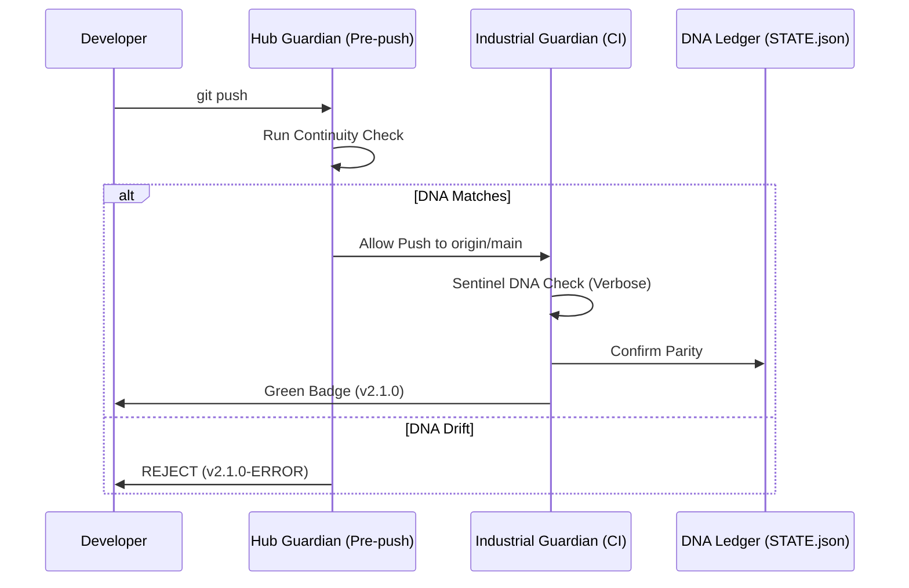
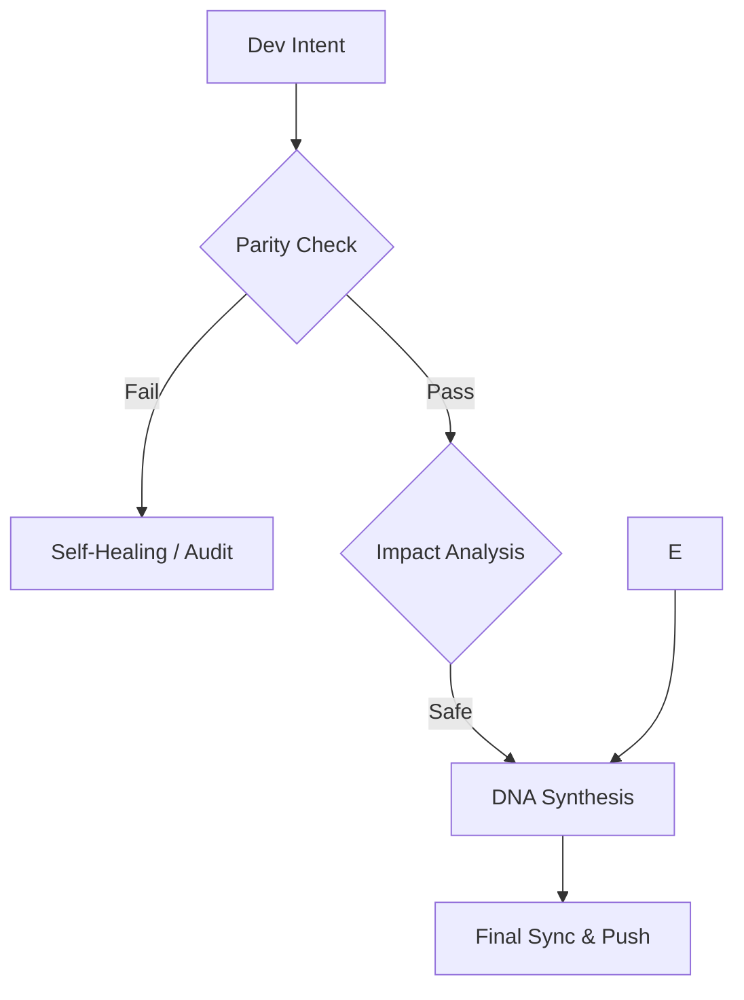

<p align="center">
  
</p>

# Continuity Legacy: Persistent Cognitive Layer 🧬

[](https://github.com/SteveBlackbeard/CONTINUITY-LEGACY-by-Ethernium/actions/workflows/industrial_guardian.yml)
[](https://github.com/SteveBlackbeard/CONTINUITY-LEGACY-by-Ethernium/releases)
[](https://github.com/SteveBlackbeard/CONTINUITY-LEGACY-by-Ethernium/blob/main/LICENSE)
[](https://www.python.org/downloads/release/python-3100/)

#### Languages
[](https://github.com/SteveBlackbeard/CONTINUITY-LEGACY-by-Ethernium/blob/main/OTHER_LANGUAGES/README_es.md) [](https://github.com/SteveBlackbeard/CONTINUITY-LEGACY-by-Ethernium/README.md) [](https://github.com/SteveBlackbeard/CONTINUITY-LEGACY-by-Ethernium/blob/main/OTHER_LANGUAGES/README_ja.md) [](https://github.com/SteveBlackbeard/CONTINUITY-LEGACY-by-Ethernium/blob/main/OTHER_LANGUAGES/README_zh.md) [](https://github.com/SteveBlackbeard/CONTINUITY-LEGACY-by-Ethernium/blob/main/OTHER_LANGUAGES/README_ru.md) [](https://github.com/SteveBlackbeard/CONTINUITY-LEGACY-by-Ethernium/blob/main/OTHER_LANGUAGES/README_fr.md) [](https://github.com/SteveBlackbeard/CONTINUITY-LEGACY-by-Ethernium/blob/main/OTHER_LANGUAGES/README_it.md) [](https://github.com/SteveBlackbeard/CONTINUITY-LEGACY-by-Ethernium/blob/main/OTHER_LANGUAGES/README_de.md) [](https://github.com/SteveBlackbeard/CONTINUITY-LEGACY-by-Ethernium/blob/main/OTHER_LANGUAGES/README_pt.md)

"**AI doesn't forget anymore.**"

*This prevents LLMs from losing context and destroying your codebase, mathematically forcing them to align with a cryptographic hash.*


---

## ⚡ 30-Second Quickstart (Professional Onboarding)
Get the entire Ethernium Continuity Ecosystem running in seconds:

```bash
# Install the unified metapackage
pip install continuity-legacy

# Initialize the Guardian DNA in your current project
continuity init

# Verify state consistency
continuity status

# [NEW] Audit project cognitive weight (tokens)
continuity-tokens scan
```

---

## 🛡️ Industrial Proof & Quality
To address the need for concrete evidence, we provide a verified Case Study and Benchmarks:
*   [**CASE_STUDY_DRIFT.md**](./CASE_STUDY_DRIFT.md): A real-world demonstration of how Continuity detects and blocks unauthorized semantic changes that Git ignores.
*   [**BENCHMARKS.md**](./BENCHMARKS.md): Measured performance results (Latencies, Memory footprint, and Merkle scan speeds).

---


<!-- DNA_CRYSTAL -->
> [!IMPORTANT]
> **DNA CRYSTAL**: `v2.1.0-c21c8265734d359e`
> [](https://github.com/SteveBlackbeard/CONTINUITY-LEGACY-by-Ethernium)

## 🏛️ Table of Contents
1. [Choose Your Edition](#-choose-your-edition)
2. [Technical Specifications](#-technical-specifications-hardware-profiles)
3. [30-Second Quickstart](#-30-second-quickstart-the-onboarding-experience)
4. [Quick Installation](#-quick-installation)
5. [Operation Modes](#-modos-de-operación-how-to-use)
6. [Core Infrastructure](#-core-infrastructure-the-cognitive-core)
7. [The Quality Flow](#-the-quality-flow-the-border-guard)
8. [Guardian DNA Algorithm](#-guardian-dna-technical-specification)
9. [Origins: The Ethernium Heritage](#-origins-the-ethernium-heritage)

---

## 🏛️ Choose Your Edition

[](https://github.com/SteveBlackbeard/CONTINUITY-LEGACY-by-Ethernium/blob/main/continuity-lite/)
_Minimalist local sync with DNA Synthesis for zero-loss handoffs._

[](https://github.com/SteveBlackbeard/CONTINUITY-LEGACY-by-Ethernium/blob/main/continuity-pro/)
_Industrial-grade border guard. Features Enterprise-grade cyber-security, RFC 6962 Merkle Hardening, and Fail-Closed Hooks._

[](https://github.com/SteveBlackbeard/CONTINUITY-LEGACY-by-Ethernium/blob/main/continuity-omega/)
_Advanced RAG, cognitive mapping, and a stunning 3D Glassmorphic Dashboard for impactful data visualization._

---

| Guide | Link |
| :--- | :--- |
| [**Industrial Guide**](./HOW_TO_USE_IT.md) | [HOW_TO_USE_IT.md](./HOW_TO_USE_IT.md) |
| [**Release Manifest**](./RELEASE_NOTES_MANIFEST.md) | [RELEASE_NOTES_MANIFEST.md](./RELEASE_NOTES_MANIFEST.md) |

---

## 🏛️ Enterprise Use Cases
Continuity Legacy solves the "Semantic Drift" in long-term AI-Human collaboration:
1. **Cross-Agent Handoffs**: Transfer full project context between different AI models (GPT-4 to Claude to local LLMs) with zero context loss.
2. **Multi-Day RAG Stability**: Ensures that Retrieval-Augmented Generation systems always point to the canonical source of truth, even after system resets.
3. **Legacy Restoration**: Instantly reconstruct the architectural intent of a project years after the last human developer has left.

---

## 🏛️ Software Supply Chain Security (SLSA)
Continuity Legacy implements high-integrity governance for the project lineage:
- **RFC 6962 Merkle Integrity**: Every markdown file is part of a Merkle Tree. A single byte change in your documentation alters the root hash.
- **Deterministic Synthesis**: Cross-platform verification (Windows/Linux) ensures that the "Project Soul" is identical across all environments.
- **Fail-Closed Hooks**: Native Git-Hooks that block pushes if the DNA drift is detected.

---

## 🏛️ The Triple-Tier Ecosystem
Continuity provides three levels of depth in governance:
- **Border Control**: Strict validation of commits against the project's logical heritage.
- **DNA Integrity**: Automated file synchronization of documentation and source code.
- **Global Awareness**: Full documentation and CLI support localized in 9 languages.
- **Diamond Sanitization**: Deep purge of encoding errors (mojibake) and streamlined terminal-friendly directory structures.
- **[NEW] Token Sentinel (v1.0)**: Integrated telemetry to monitor project "Cognitive Weight" and optimize LLM context consumption.

---

## 📊 Technical Specifications (Hardware Profiles)
Each edition is optimized for specific resource footprints:

| Edition | RAM (Min) | Storage | Dependencies | Best For |
| :--- | :--- | :--- | :--- | :--- |
| **Lite** | < 100 MB | < 5 MB | Zero | Local Dev / CI-CD |
| **Pro** | 4 GB | 50 MB | Standard | Industrial Handoffs |
| **Omega** | 16 GB+ | 500 MB+ | RAG/Graph | Enterprise Strategy |

---

## ⏱️ 30-Second Quickstart (The Onboarding Experience)

> **`example-project/`** is a pre-configured sandbox included in this repository. It simulates a real project already managed by Continuity Legacy.

1.  **Navigate to the example environment**:
    ```bash
    cd example-project
    ```
2.  **Verify the DNA Parity**:
    ```bash
    python ../continuity-lite/run_continuity_lite.py check
    ```
3.  **Expected Outcome**: You will see a green `[✔] Parity Confirmed`.

---

## 🚀 Quick Installation

```bash
# 1. Clone the repository
git clone https://github.com/SteveBlackbeard/CONTINUITY-LEGACY-by-Ethernium.git
cd CONTINUITY-LEGACY-by-Ethernium

# 2. Install from PyPI (when published)
pip install ethernium-continuity-lite

# Or install locally in editable mode
pip install -e continuity-lite

# 3. Activate the Sentinel Guardian (auto Git-Hooks + DNA init)
continuity-lite init

# 4. Verify your DNA parity
continuity-lite check
```

---

## 🏛️ Architecture: Memory Core
Continuity Legacy uses a **Total Decoupling** design. Editions are not a monolithic block, but independent tools operating on a single source of truth:

*   **Absolute Independence**: Using `Lite` does not consume `Pro` or `Omega` resources. Engines only consume RAM/CPU on demand.
*   **Common Substrate**: All editions share the `.continuity/STATE.json` and `PROJECT_CONTEXT.md`.
*   **Passive Interoperability**: A change registered by one edition is immediately visible to others, ensuring the logical lineage flows without friction.

### 🧠 Omega Edition: Cognitive Perspective
The **Omega edition** is our Enterprise-grade Oracle. It provides advanced RAG, cognitive mapping, and semantic impact analysis for deterministic decision protection.

*Ethernium Omega Engine integrated into the core dashboard (Access restricted).*

### 📊 The deterministic Audit Cycle


---

## 🚀 Operating Modes
Continuity Legacy can be integrated into your workflow in three main ways:

1.  **Autonomous Mode (CLI)**: Run `continuity-lite status` or `check` manually.
2.  **Sentinel Mode (Automatic Guardian)**: Use `continuity-lite init` to install Git-Hooks automatically.
3.  **Auditor Mode (Manual DNA)**: Use the parity script to generate drift reports.

---

## 🧠 Key Features (Industrial Symphony)
- **Metabolism Optimization**: Typ-Rich engine with <100ms startup and lazy-loading of cores.
- **DNA Synthesis**: Merkle Tree cryptographic protection (SHA-256).
- **Sovereign Identity**: Digital signing of Project DNA using ED25519 (v2.6.0+).
- **Dual Bridge Portals**: Symmetric Identity for ZIP files (`Ethernium_Portal_Inside/Outside`).
- **Token Sentinel**: Context telemetry and x10 optimization via ENE.
- **Governance**: Sentinel Guardian with automatic Git-Hooks and session logging.
- **Global Symmetry**: Industrial-grade documentation and CLI support in 9 languages.
- **Industrial Sanitization**: Full purge of UTF-16 files and tactical debris.

---

## 🧩 Core Infrastructure (The Cognitive Core)
Continuity organizes project intelligence into structured nodes:
*   **.continuity/**: The memory core with `TIMELINE.md` and `DECISIONS_LOG.md`.
*   **`STATE.json`**: State snapshot protected by SHA-256 signature.
*   **`PROJECT_CONTEXT.md`**: Defines the rules and the strategic soul of the system.

---

## 🔍 The Quality Flow (The Border Guard)
Continuity actúa como un "Socratic Firewall". Protege tu intención de diseño mediante un bucle de validación determinista:



---

## 🧬 Guardian DNA (Technical Specification)
**Continuity Legacy** utiliza un algoritmo de hashing "Nucleótido" determinista para generar la identidad única de un proyecto.

- **Nucleotide Hashing**: Cada artefacto canónico (`.md`, `.json`) es procesado usando **SHA-256**.
- **DNA Synthesis**: El sistema agrega estos segmentos en un **Merkle Tree** jerárquico.
- **The Merkle Root**: El hash final que representa el **Estado Absoluto**.

---

## 🌌 Origins: The Ethernium Heritage
**Continuity Legacy** was born from the systemic need within the **Ethernium Ecosystem**, an evolving frontier of cognitive computing and autonomous systems. Where session resets occur millions of times, the risk of "Semantic Entropy" was critical. We needed to ensure that the *soul* of a project transitioned from one cognitive instance to the next without loss or drift.

---
*Continuity Legacy: Protecting the logical lineage of your software.*