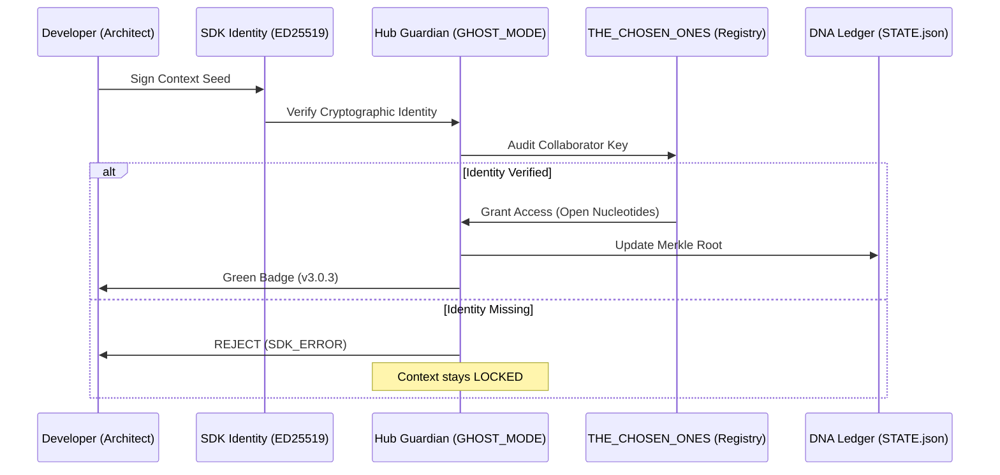
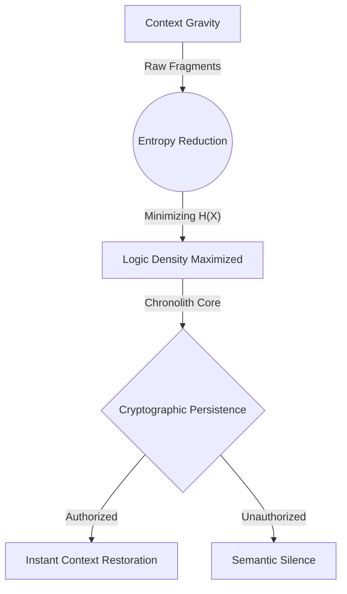

<p align="center">
  
</p>

# Chronolith: Persistent Cognitive Layer

[](https://github.com/SteveBlackbeard/CHRONOLITH-by-Ethernium/actions/workflows/industrial_guardian.yml)
[](https://github.com/SteveBlackbeard/CHRONOLITH-by-Ethernium/releases)
[](https://github.com/SteveBlackbeard/CHRONOLITH-by-Ethernium/blob/main/LICENSE)
[](https://www.python.org/downloads/release/python-3100/)

#### Languages
[](https://github.com/SteveBlackbeard/CHRONOLITH-by-Ethernium/blob/main/OTHER_LANGUAGES/README_es.md) [](https://github.com/SteveBlackbeard/CHRONOLITH-by-Ethernium/README.md) [](https://github.com/SteveBlackbeard/CHRONOLITH-by-Ethernium/blob/main/OTHER_LANGUAGES/README_ja.md) [](https://github.com/SteveBlackbeard/CHRONOLITH-by-Ethernium/blob/main/OTHER_LANGUAGES/README_zh.md) [](https://github.com/SteveBlackbeard/CHRONOLITH-by-Ethernium/blob/main/OTHER_LANGUAGES/README_ru.md) [](https://github.com/SteveBlackbeard/CHRONOLITH-by-Ethernium/blob/main/OTHER_LANGUAGES/README_fr.md) [](https://github.com/SteveBlackbeard/CHRONOLITH-by-Ethernium/blob/main/OTHER_LANGUAGES/README_it.md) [](https://github.com/SteveBlackbeard/CHRONOLITH-by-Ethernium/blob/main/OTHER_LANGUAGES/README_de.md) [](https://github.com/SteveBlackbeard/CHRONOLITH-by-Ethernium/blob/main/OTHER_LANGUAGES/README_pt.md) [](https://github.com/SteveBlackbeard/CHRONOLITH-by-Ethernium/blob/main/OTHER_LANGUAGES/README_ko.md) [](https://github.com/SteveBlackbeard/CHRONOLITH-by-Ethernium/blob/main/OTHER_LANGUAGES/README_ar.md)

**A cryptographic integrity layer for the documents that carry a project's
intent across AI-assisted sessions.**

Chronolith hashes your canonical project documents into a Merkle tree,
records a signed baseline, and fails closed when the current state no longer
matches it — so unintended changes to a project's context are caught before they
propagate, instead of being discovered later. It does not read minds or guarantee
an AI "remembers"; it gives you a verifiable record of what the agreed context
*was*, and a hard stop when it drifts.

> The names in this project (DNA, sovereign, nucleotides) are deliberate
> narrative. What they map to technically — and why — is documented plainly in
> [LORE.md](./LORE.md). The engineering docs below make only claims a test or a
> command can back up.

---

## What it is for
Chronolith addresses semantic drift in long-term AI–human collaboration:
1. **Cross-agent handoffs** — carry a signed, verifiable snapshot of project
   context between models and sessions, and detect if it was altered in transit.
2. **RAG source-of-truth integrity** — keep retrieval pointed at documents whose
   state is cryptographically pinned, and notice when they change.
3. **Architectural provenance** — an auditable, signed history (and optional
   Bitcoin timestamp) of how the project's canonical documents evolved.

---

## 30-Second Quickstart (Professional Onboarding)
Get the entire Ethernium Chronolith Ecosystem running in seconds:

```bash
# Install the unified metapackage
pip install chronolith

# Initialize the Guardian DNA in your current project
chronolith init

# Verify state consistency
chronolith status

# [NEW] Audit project cognitive weight (tokens)
chronolith-tokens scan
```

---

## Industrial Proof & Quality

**A DNA state from this project is anchored in Bitcoin block 958484.** You can
verify it without trusting this repository or its author — the proof and the
one-line command are in [docs/evidence/](./docs/evidence/), alongside measured
guardian benchmarks and the adversarial (red-team) results.

To address the need for concrete evidence, we provide a verified Case Study and Benchmarks:
*   [**CASE_STUDY_DRIFT.md**](./CASE_STUDY_DRIFT.md): A real-world demonstration of how Chronolith detects and blocks unauthorized semantic changes that Git ignores.
*   [**BENCHMARKS.md**](./BENCHMARKS.md): Measured performance results (Latencies, Memory footprint, and Merkle scan speeds).

The three editions install standalone (each vendors its own core), so run the
full audit per edition in isolated processes — one command:

```bash
python scripts/audit_all.py            # per-edition tests + cross-edition core parity
python scripts/audit_all.py --install  # also build + install each guardian in a clean venv
```

Cross-edition parity guards the deliberate vendoring: if a shared core primitive
drifts between Lite/Pro/Omega, the audit fails.

---


<!-- DNA_CRYSTAL -->
> [!IMPORTANT]
> **DNA CRYSTAL**: `v3.0.3-governed`
> [](https://github.com/SteveBlackbeard/CHRONOLITH-by-Ethernium)

## Table of Contents
1. [Choose Your Edition](#-choose-your-edition)
2. [Technical Specifications](#-technical-specifications-hardware-profiles)
3. [30-Second Quickstart](#-30-second-quickstart-the-onboarding-experience)
4. [Quick Installation](#-quick-installation)
5. [Operation Modes](#-operating-modes)
6. [Core Infrastructure](#-core-infrastructure-the-cognitive-core)
7. [The Quality Flow](#-the-quality-flow-the-border-guard)
8. [Guardian DNA Algorithm](#-guardian-dna-technical-specification)
9. [Origins: The Ethernium Heritage](#-origins-the-ethernium-heritage)
10. [Documentation Quick Index](#documentation-quick-index)
11. [Documentation Index](#documentation-index)

---

## Choose Your Edition

[](https://github.com/SteveBlackbeard/CHRONOLITH-by-Ethernium/blob/main/chronolith-lite/)
_Minimalist local sync with DNA Synthesis for zero-loss handoffs._

[](https://github.com/SteveBlackbeard/CHRONOLITH-by-Ethernium/blob/main/chronolith-pro/)
_Industrial-grade border guard. Features Enterprise-grade cyber-security, RFC 6962 Merkle Hardening, and Fail-Closed Hooks._

[](https://github.com/SteveBlackbeard/CHRONOLITH-by-Ethernium/blob/main/chronolith-omega/)
_Advanced RAG and cognitive mapping over the governed corpus._

---

| Guide | Link |
| :--- | :--- |
| [**Start here**](./GETTING_STARTED.md) | Five minutes: pick an edition, crystallize a project, watch drift get caught |
| [**Industrial Guide**](./HOW_TO_USE_IT.md) | [HOW_TO_USE_IT.md](./HOW_TO_USE_IT.md) |
| [**Editor & Agent Integration**](./docs/EDITOR_AGENT_INTEGRATION.md) | VS Code, Cursor, MCP and agent-host boundary |
| [**External Tools**](./docs/external/README.md) | Seneschal extraction notes |
| [**Release Manifest**](./RELEASE_NOTES_MANIFEST.md) | [RELEASE_NOTES_MANIFEST.md](./RELEASE_NOTES_MANIFEST.md) |

---

## Software Supply Chain Security (SLSA)
Chronolith implements high-integrity governance for the project lineage:
- **Path-bound Merkle Integrity**: Every markdown file is a leaf keyed by its path, so a one-byte edit — or a rename, or a content swap between two files — changes the root hash.
- **Real drift detection**: `check` compares the computed root against a signed baseline and halts (fail-closed) when they diverge — not only on secrets or doc-parity.
- **Sovereign cryptography (Pro)**: Ed25519-signed baselines, an append-only DNA transparency chain, O(log n) Merkle inclusion proofs, real X25519 sealed context, and a passphrase-protected key vault. See [chronolith-pro/SOVEREIGN_SECURITY.md](./chronolith-pro/SOVEREIGN_SECURITY.md).
- **Deterministic synthesis**: LF-normalized hashing gives the same root on Windows and Linux, so verification is cross-platform.
- **External witness (Pro)**: `anchor` timestamps the transparency-chain head into Bitcoin via OpenTimestamps, so a third party can verify the DNA state existed at a given time without trusting the operator. See [SOVEREIGN_SECURITY.md](./chronolith-pro/SOVEREIGN_SECURITY.md).
- **Fail-closed hooks**: Git hooks that block a push when DNA drift, a broken transparency chain, or an invalid signature is detected.

---

## The Triple-Tier Ecosystem
Chronolith provides three levels of depth in governance:
- **Border Control**: Strict validation of commits against the project's logical heritage.
- **DNA Integrity**: Automated file synchronization of documentation and source code.
- **Global Awareness**: Full documentation and CLI support localized in 9 languages.
- **Diamond Sanitization**: Deep purge of encoding errors (mojibake) and streamlined terminal-friendly directory structures.
- **[NEW] Token Sentinel (v1.0)**: Integrated telemetry to monitor project "Cognitive Weight" and optimize LLM context consumption.

---

## Omega: Asking Your Project Why

Lite and Pro answer *"has this changed?"*. Omega answers *"why did we decide
this?"* — semantic search over the governed corpus, entirely local.

```bash
pip install chronolith-omega

chronolith-omega init      # memory core + auto-index hook
chronolith-omega index     # build the local vector store
chronolith-omega query "why did we choose Ed25519 for signatures?"
```

`query` ranks the corpus by meaning rather than keywords, so it finds the
decision log for that question even though the log never contains the word
"why" — and it answers across languages, because the embeddings are
multilingual, not translated.

```bash
chronolith-omega map       # -> outputs/chronolith/cognitive_map.html
```

`map` renders the decision lineage as an interactive hierarchical graph: each
logged decision becomes a node, chained in the order it was taken.

> [!NOTE]
> The generated map loads `vis-network` from a CDN, so that one HTML file needs
> network access to render. Indexing and querying are fully local — nothing
> about your corpus leaves the machine.

---

## External Tools
**[Seneschal](https://github.com/SteveBlackbeard/SENESCHAL-by-Ethernium)** is the external agent-operations layer for token frugality, prompt-risk scanning, scoped capabilities, MCP, and local/cloud routing. Chronolith remains the Python runtime and governance core.
> [!TIP]
> **READ MORE:** [**docs/external/README.md**](./docs/external/README.md)

---

## Technical Specifications (Hardware Profiles)
Each edition is optimized for specific resource footprints:

| Edition | RAM (Min) | Storage | Dependencies | Best For |
| :--- | :--- | :--- | :--- | :--- |
| **Lite** | < 100 MB | < 5 MB | Zero | Local Dev / CI-CD |
| **Pro** | 4 GB | 50 MB | Standard | Industrial Handoffs |
| **Omega** | 16 GB+ | 500 MB+ | RAG/Graph | Enterprise Strategy |

---

## 30-Second Quickstart (The Onboarding Experience)

> **`examples/example-project/`** is a pre-configured sandbox included in this repository. It simulates a real project already managed by Chronolith.

1.  **Navigate to the example environment**:
    ```bash
    cd examples/example-project
    ```
2.  **Verify the DNA Parity**:
    ```bash
    python ../../chronolith-lite/run_chronolith_lite.py check
    ```
3.  **Expected Outcome**: You will see a green `[OK] Parity Confirmed`.

---

## Quick Installation

```bash
# 1. Clone the repository
git clone https://github.com/SteveBlackbeard/CHRONOLITH-by-Ethernium.git
cd CHRONOLITH-by-Ethernium

# 2. Install from PyPI (when published)
pip install chronolith-lite

# Or install locally in editable mode
pip install -e chronolith-lite

# 3. Activate the Sentinel Guardian (auto Git-Hooks + DNA init)
chronolith-lite init

# 4. Verify your DNA parity
chronolith-lite check
```

---

## Architecture: Memory Core
Chronolith uses a **Total Decoupling** design. Editions are not a monolithic block, but independent tools operating on a single source of truth:

*   **Absolute Independence**: Using `Lite` does not consume `Pro` or `Omega` resources. Engines only consume RAM/CPU on demand.
*   **Common Substrate**: All editions share the `.chronolith/STATE.json` and `PROJECT_CONTEXT.md`.
*   **Passive Interoperability**: A change registered by one edition is immediately visible to others, ensuring the logical lineage flows without friction.

### Governed Cryptographic Audit Cycle


---

## Operating Modes
Chronolith can be integrated into your workflow in three main ways:

1.  **Autonomous Mode (CLI)**: Run `chronolith-lite status` or `check` manually.
2.  **Sentinel Mode (Automatic Guardian)**: Use `chronolith-lite init` to install Git-Hooks automatically.
3.  **Auditor Mode (Manual DNA)**: Use the parity script to generate drift reports.

---

## Key Features (Industrial Symphony)
- **Metabolism Optimization**: Typ-Rich engine with <100ms startup and lazy-loading of cores.
- **DNA Synthesis**: Merkle Tree cryptographic protection (SHA-256).
- **Cryptographic Identity**: Digital signing of Project DNA using ED25519 (v2.6.0+).
- **Dual Bridge Portals**: Symmetric Identity for ZIP files (`Ethernium_Portal_Inside/Outside`).
- **Token Sentinel**: Context telemetry and x10 optimization via ENE.
- **Governance**: Sentinel Guardian with automatic Git-Hooks and session logging.
- **Global Symmetry**: Industrial-grade documentation and CLI support in 9 languages.
- **Industrial Sanitization**: Full purge of UTF-16 files and tactical debris.

---

## Core Infrastructure (The Cognitive Core)
Chronolith organizes project intelligence into structured nodes:
*   **.chronolith/**: The memory core with `TIMELINE.md` and `DECISIONS_LOG.md`.
*   **`STATE.json`**: State snapshot protected by SHA-256 signature.
*   **`PROJECT_CONTEXT.md`**: Defines the rules and the strategic soul of the system.

---

## Tokenator v2.9.3: Information Physics & SDK Sealing
Tokenator is the cognitive engine that manages context density and security. It operates on the principles of **Information Theory** to minimize token cost while maximizing logical purity.

---

## The Quality Flow (The Border Guard)
Chronolith acts as a "Socratic Firewall". It protects your design intent through a deterministic validation loop.

---

### Technical Flow: The Synthesis Engine


### Conceptual Flow: Information Physics (Singularity)


---

## Guardian DNA (Technical Specification)
**Chronolith** uses a deterministic "Nucleotide" hashing algorithm to generate the unique identity of a project.

- **Nucleotide Hashing**: Each canonical artifact (`.md`, `.json`) is processed using **SHA-256**.
- **DNA Synthesis**: The system aggregates these segments into a hierarchical **Merkle Tree**.
- **The Merkle Root**: El hash final que representa el **Estado Absoluto**.

---

## Origins: The Ethernium Heritage
## Community & Governance
The governed runtime phase is protected by explicit contracts, health checks, and baseline verification. Open source contributions are welcomed, while critical logic and symbolic DNA remain protected by review gates.

- **How to Collaborate**: See [CONTRIBUTING.md](CONTRIBUTING.md) for keys and access.
- **Support**: Reach out via [X (@ethernium)](https://x.com/ethernium) or [Email](mailto:etherniumcorp@outlook.com)

**Chronolith** was born from the systemic need within the **Ethernium Ecosystem**, an evolving frontier of cognitive computing and autonomous systems. Where session resets occur millions of times, the risk of "Semantic Entropy" was critical. We needed to ensure that the *soul* of a project transitioned from one cognitive instance to the next without loss or drift.

---
*Chronolith: Protecting the logical lineage of your software.*

---

## Documentation Quick Index

| Section | What You Will Find |
| --- | --- |
| [Root Documents](#root-documents) | Core project docs: changelog, governance, usage, security, and DNA. |
| [Process Documents](#process-documents) | Release checklists, staging plans, session logs, and token reports. |
| [Archive Documents](#archive-documents) | Historical portal/demo artifacts kept out of the root view. |
| [Root Translations](#root-translations) | Localized root README and release-note variants. |
| [External Tool Documents](#external-tool-documents) | Seneschal extraction notes and adapter boundary. |
| [Lite Edition Documents](#lite-edition-documents) | Lightweight package docs and handoff references. |
| [Pro Edition Documents](#pro-edition-documents) | Full operational package docs, roadmap, troubleshooting, and examples. |
| [Omega Edition Documents](#omega-edition-documents) | Omega package overview and context docs. |
| [Example and Demo Documents](#example-and-demo-documents) | Demo and sample-project walkthrough material. |
| [Internal Chronolith Core Documents](#internal-chronolith-core-documents) | Internal chronolith ledgers, templates, boot protocols, and registry docs. |

## Documentation Index

### Root Documents
| Document | Purpose |
| --- | --- |
| `README.md` | Main overview of Chronolith, its philosophy, architecture, and core capabilities. |
| `CHANGELOG.md` | Historical record of major releases, hardening milestones, and ecosystem evolution. |
| `PROJECT_CONTEXT.md` | Strategic and conceptual framing of the project, including its operating intent. |
| `PROJECT_DNA.md` | Canonical description of project identity and continuity lineage. |
| `CONTRIBUTING.md` | Collaboration rules, contribution entry points, and protected-logic contribution policy. |
| `CONTRIBUTORS.md` | Contributor-facing collaboration principles and engineering expectations. |
| `SECURITY.md` | Security posture, protected logic expectations, and handling of sensitive system areas. |
| `GOVERNANCE.md` | Governance model, stewardship expectations, and system authority boundaries. |
| `HOW_TO_USE_IT.md` | Practical guide for installing, running, and using Chronolith. |
| `BENCHMARKS.md` | Performance and measurement notes for the system and its workflows. |
| `CASE_STUDY_DRIFT.md` | Analysis of drift, chronolith failure modes, and why the system exists. |
| `ETHERNIUM_UNIVERSAL_DNA.md` | Ethernium-wide lineage and identity framing for the broader ecosystem. |
| `RELEASE_NOTES_MANIFEST.md` | Release-note manifest and documentation map for published versions. |

### Process Documents
| Document | Purpose |
| --- | --- |
| `docs/process/SESSION_LOG.md` | Working-session trace and continuity record for recent development cycles. |
| `docs/process/SESSION_TOKEN_REPORT.md` | Token telemetry and session-level reporting artifacts. |
| `docs/process/REPO_AND_PYPI_RELEASE_CHECKLIST.md` | Release checklist for GitHub publication and PyPI packaging. |
| `docs/process/RELEASE_STAGING_PLAN.md` | Commit/staging strategy for safe release preparation. |

### Archive Documents
| Document | Purpose |
| --- | --- |
| `docs/archive/Ethernium_Portal_Outside.json` | Legacy portal metadata retained for traceability. |
| `docs/archive/demo_portal.zip` | Legacy demo portal artifact retained outside the root view. |

### Root Translations
| Document Set | Purpose |
| --- | --- |
| `OTHER_LANGUAGES/README_*.md` | Translated editions of the main root README. |
| `OTHER_LANGUAGES/RELEASE_v2.1.0_*.md` | Translated release notes for the v2.1.0 release line. |
| `OTHER_LANGUAGES/RELEASE_v2.1.0-NEXUS_*.md` | Translated release notes for the NEXUS-specific release line. |

### External Tool Documents
| Document | Purpose |
| --- | --- |
| `docs/external/README.md` | Index of external tools related to Chronolith. |
| `docs/external/AGENTOPS.md` | Seneschal product boundary, token-frugality role, usage, and MCP notes. |

### Lite Edition Documents
| Document | Purpose |
| --- | --- |
| `chronolith-lite/README.md` | User-facing guide for the Lite edition. |
| `chronolith-lite/PROJECT_CONTEXT.md` | Lite edition context, scope, and intended usage model. |
| `chronolith-lite/LIVE_HANDOFF.md` | Handoff guidance for continuity across active sessions. |
| `chronolith-lite/OTHER_LANGUAGES/README_*.md` | Translated Lite README set. |

### Pro Edition Documents
| Document | Purpose |
| --- | --- |
| `chronolith-pro/README.md` | Main guide for the Pro edition and its richer operational tooling. |
| `chronolith-pro/CHANGELOG.md` | Version history specific to the Pro edition. |
| `chronolith-pro/CONTRIBUTING.md` | Contribution rules specific to the Pro package and workflow. |
| `chronolith-pro/PROJECT_CONTEXT.md` | Pro edition mission, boundaries, and operating assumptions. |
| `chronolith-pro/ROADMAP.md` | Planned feature trajectory and future development priorities. |
| `chronolith-pro/MAINTAINERS.md` | Maintainer responsibilities and project stewardship notes. |
| `chronolith-pro/SECURITY.md` | Security expectations and safeguards for the Pro edition. |
| `chronolith-pro/TROUBLESHOOTING.md` | Problem-solving guide for common runtime and workflow issues. |
| `chronolith-pro/USE_CASES.md` | Representative workflows and intended real-world usage scenarios. |
| `chronolith-pro/AGENT_START.md` | Agent/session bootstrap guidance for Pro operators. |
| `chronolith-pro/examples/README.md` | Example pack overview for Pro usage patterns. |
| `chronolith-pro/examples/sample_project/README.md` | Walkthrough for the sample Pro project. |
| `chronolith-pro/OTHER_LANGUAGES/README_*.md` | Translated Pro README set. |
| `chronolith-pro/OTHER_LANGUAGES/*/README.md` | Language-scoped translated Pro overviews. |
| `chronolith-pro/OTHER_LANGUAGES/*/TROUBLESHOOTING.md` | Language-scoped translated troubleshooting guides. |
| `chronolith-pro/OTHER_LANGUAGES/*/USE_CASES.md` | Language-scoped translated use-case guides. |
| `chronolith-pro/chronolith_pro/chronolith/README.md` | Packaged README embedded in the Pro Python distribution. |

### Omega Edition Documents
| Document | Purpose |
| --- | --- |
| `chronolith-omega/README.md` | Main guide for the Omega edition. |
| `chronolith-omega/PROJECT_CONTEXT.md` | Omega edition context and high-level operating frame. |
| `chronolith-omega/OTHER_LANGUAGES/README_*.md` | Translated Omega README set. |
| `chronolith-omega/chronolith_omega/chronolith/README.md` | Packaged README embedded in the Omega Python distribution. |

### Example and Demo Documents
| Document | Purpose |
| --- | --- |
| `examples/example-project/README.md` | Example project showing how Chronolith is applied in practice. |
| `examples/example-project/DAILY_HANDOFF_SCENARIO.md` | Example of session-to-session chronolith handoff. |
| `examples/demo-folder/README.md` | Demo folder notes for lightweight demonstration material. |

### Internal Chronolith Core Documents
| Document | Purpose |
| --- | --- |
| `.chronolith/DECISIONS_LOG.md` | Local architectural decision ledger for this repo. |
| `.chronolith/PROJECT_DNA.md` | Local DNA record for project identity. |
| `chronolith-pro/.chronolith/README.md` | Overview of the Pro chronolith core internals. |
| `chronolith-pro/.chronolith/AGENT_ACTIVATION_PROTOCOL.md` | Pro agent activation contract. |
| `chronolith-pro/.chronolith/BOOT_SEQUENCE.md` | Boot process for Chronolith initialization. |
| `chronolith-pro/.chronolith/BYPASS_LOG.md` | Record of bypasses, exceptions, or chronolith-critical deviations. |
| `chronolith-pro/.chronolith/CONTEXT_CHRONOLITH.md` | Chronolith-memory protocol for Pro. |
| `chronolith-pro/.chronolith/DECISIONS_LOG.md` | Pro-specific decision ledger. |
| `chronolith-pro/.chronolith/LIVE_HANDOFF.md` | Pro live handoff instructions. |
| `chronolith-pro/.chronolith/TIMELINE.md` | Pro chronolith timeline. |
| `chronolith-pro/.chronolith/templates/README.md` | Template overview for Chronolith scaffolds. |
| `chronolith-pro/.chronolith/templates/external_docs/README.md` | External-document template usage notes. |
| `chronolith-pro/.chronolith/registry/README.md` | Registry notes for internal chronolith bookkeeping. |

### Release Status
`v3.0.3` is the next governed release target. PyPI still exposes `v3.0.2` until the immutable upload is performed.

Release notes: [`docs/releases/v3.0.3.md`](./docs/releases/v3.0.3.md)

### Published PyPI Links (v3.0.2)
- `https://pypi.org/project/chronolith/3.0.2/`
- `https://pypi.org/project/chronolith-lite/3.0.2/`
- `https://pypi.org/project/chronolith-pro/3.0.2/`
- `https://pypi.org/project/chronolith-omega/3.0.2/`
