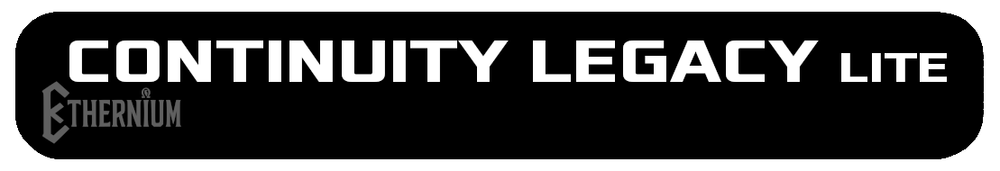
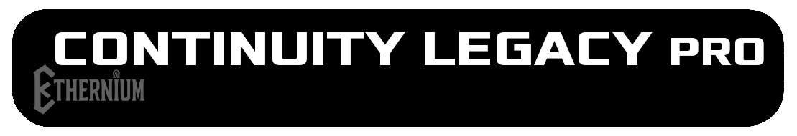
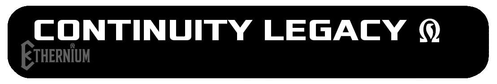
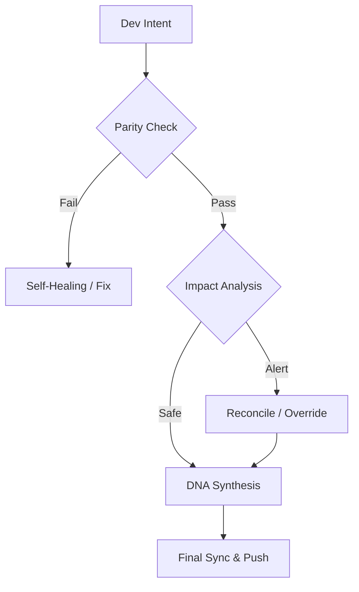

# Continuity Legacy v1.3.1: Global Continuity Framework

[](https://github.com/SteveBlackbeard/CONTINUITY-LEGACY-by-Ethernium)
[](https://opensource.org/licenses/MIT)
[](https://www.python.org/)
[](https://github.com/SteveBlackbeard/CONTINUITY-LEGACY-by-Ethernium)
[](https://github.com/SteveBlackbeard/CONTINUITY-LEGACY-by-Ethernium)

**Continuity** is a professional-grade synchronization framework designed to protect the logical lineage of your software during AI-to-Human and AI-to-AI handoffs. It ensures that development intent, architectural decisions, and tactical context are never lost.

---

## 🏢 Choose Your Edition

[](./continuity-lite)
<p align="center"><sub><b>Continuity Legacy Lite — Zero-Friction Guardian</b>: Minimalist local sync with DNA Synthesis for zero-loss handoffs.</sub></p>

[](./continuity)
<p align="center"><sub><b>Continuity Legacy Pro — Tactical Engine</b>: Industrial-grade border guard with security audits and global synchronization.</sub></p>

[](./continuity-omega)
<p align="center"><sub><b>Continuity Legacy Omega — Enterprise Oracle</b>: Advanced RAG, cognitive mapping, and proactive impact analysis.</sub></p>

---

## 🚀 Quick Installation

```bash
# 1. Clone the repository
git clone https://github.com/SteveBlackbeard/CONTINUITY-LEGACY-by-Ethernium.git
cd CONTINUITY-LEGACY-by-Ethernium

# 2. Install the Lite Edition (Most recommended for daily use)
pip install -e continuity-lite

# 3. Setup the Git Border Guard
python continuity-lite/run_continuity_lite.py --hook
```

---

## ⚡ Minimal Usage (5-Line Start)

```python
# Just run the guardian in your terminal
python continuity-lite/run_continuity_lite.py

# Expected Output:
# [*] CONTINUITY LEGACY Lite - DNA Validation
# [] Parity Confirmed. Ready for safe handoff.
```

---

## 🔍 The Quality Flow (The Border Guard)

Continuity acts as a "Socratic Firewall" for your project. Here is how your design intent is protected:



---

### 🧠 Omega Edition: Cognitive Insight *(In Development)*
The **Omega edition** is our Enterprise-grade Tier. It provides a visual, interactive decision lineage and semantic impact analysis to prevent architectural drift.


---

## 🌌 Origins: The Ethernium Heritage

**Continuity Legacy** was born out of necessity within the **Ethernium Ecosystem**—a vast, evolving frontier of cognitive computing and autonomous systems. As Ethernium grew in complexity, the need to preserve state, intent, and architectural lineage became paramount.

This framework is a specialized extraction from that ecosystem, refined and hardened for standalone, production-ready use. By using Continuity, you are adopting a piece of the Ethernium philosophy: *perpetual state, unbroken lineage, and cognitive integrity.*

---

## 🏷️ Keywords
`context-management`, `ai-memory`, `rag-framework`, `project-continuity`, `decision-logging`, `software-governance`

---
*Continuity: Protecting the logical lineage of your software.*
