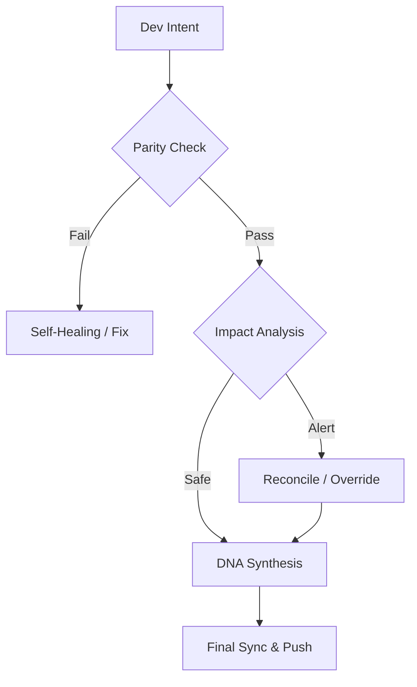

# Continuity Legacy v2.1.0: Ethernium Evolution Framework

<!-- DNA_CRYSTAL -->
> [!IMPORTANT]
> **DNA CRYSTAL**: `v2.1.1-77326b6b409dda4a`
> [](https://github.com/SteveBlackbeard/CONTINUITY-LEGACY-by-Ethernium)


#### Languages
[](https://github.com/SteveBlackbeard/CONTINUITY-LEGACY-by-Ethernium/blob/main/OTHER_LANGUAGES/RELEASE_v1.3.1_es.md) [](https://github.com/SteveBlackbeard/CONTINUITY-LEGACY-by-Ethernium/blob/main/RELEASE_NOTES_MANIFEST.md) [](https://github.com/SteveBlackbeard/CONTINUITY-LEGACY-by-Ethernium/blob/main/OTHER_LANGUAGES/RELEASE_v1.3.1_ja.md) [](https://github.com/SteveBlackbeard/CONTINUITY-LEGACY-by-Ethernium/blob/main/OTHER_LANGUAGES/RELEASE_v1.3.1_zh.md) [](https://github.com/SteveBlackbeard/CONTINUITY-LEGACY-by-Ethernium/blob/main/OTHER_LANGUAGES/RELEASE_v1.3.1_ru.md) [](https://github.com/SteveBlackbeard/CONTINUITY-LEGACY-by-Ethernium/blob/main/OTHER_LANGUAGES/RELEASE_v1.3.1_fr.md) [](https://github.com/SteveBlackbeard/CONTINUITY-LEGACY-by-Ethernium/blob/main/OTHER_LANGUAGES/RELEASE_v1.3.1_it.md) [](https://github.com/SteveBlackbeard/CONTINUITY-LEGACY-by-Ethernium/blob/main/OTHER_LANGUAGES/RELEASE_v1.3.1_de.md) [](https://github.com/SteveBlackbeard/CONTINUITY-LEGACY-by-Ethernium/blob/main/OTHER_LANGUAGES/RELEASE_v1.3.1_pt.md)

[](https://github.com/SteveBlackbeard/CONTINUITY-LEGACY-by-Ethernium) [](https://opensource.org/licenses/MIT) [](https://www.python.org/) [](https://github.com/SteveBlackbeard/CONTINUITY-LEGACY-by-Ethernium) [](https://github.com/SteveBlackbeard/CONTINUITY-LEGACY-by-Ethernium/actions/workflows/continuity.yml) [](https://github.com/SteveBlackbeard/CONTINUITY-LEGACY-by-Ethernium)

<p align="center">
  
</p>

Continuity is now structured into three specialized editions:

> **“Git for cognition” — but with structured memory, decision tracking, and operational handoff.**

**Continuity** is a professional-grade synchronization framework designed to protect the logical lineage of your software during AI-to-Human and AI-to-AI handoffs. It ensures that development intent, architectural decisions, and tactical context are never lost.

## 🏢 Choose Your Edition

[](https://github.com/SteveBlackbeard/CONTINUITY-LEGACY-by-Ethernium/blob/main/continuity-lite/)

_Minimalist local sync with DNA Synthesis for zero-loss handoffs.</sub></p>_

[](https://github.com/SteveBlackbeard/CONTINUITY-LEGACY-by-Ethernium/blob/main/continuity-pro/)

_Industrial-grade border guard with security audits and global synchronization.</sub></p>_

[](https://github.com/SteveBlackbeard/CONTINUITY-LEGACY-by-Ethernium/blob/main/continuity-omega/)

_Advanced RAG, cognitive mapping, and proactive impact analysis.</sub></p_

---

## 🧠 The Problem vs. The Solution

Modern AI workflows break in one critical area: **Context resets between sessions**. Agents lose identity, decisions are not persisted structurally, and handoffs are fragile.

**Continuity Legacy** introduces a **persistent cognitive layer** that turns fragmented AI workflows into coherent, everlasting systems.

```text
Context → State → Decisions → Timeline → Handoff
```

## ⏱️ 30-Second Quickstart (The Onboarding Experience)

> **`example-project/`** is a pre-configured sandbox included in this repository. It simulates a real project already managed by Continuity Legacy — complete with `PROJECT_CONTEXT.md`, `STATE.json`, `ROADMAP.md`, and a `.continuity/` memory core. Use it to experience the full DNA validation flow in under 30 seconds, without touching your own codebase.

If you want to see **Continuity Legacy** in action right now:

1.  **Navigate to the example environment**:
    ```bash
    cd example-project
    ```
2.  **Verify the DNA Parity**:
    ```bash
    # Run the DNA Guardian (Lite Mode)
    python ../continuity-lite/run_continuity_lite.py
    ```
3.  **Expected Outcome**: You will see a green `[✔] Parity Confirmed`. This simulates a successful handoff where the AI understands the 100% architectural state.

---

## 🚀 Quick Installation

```bash
# 1. Clone the repository
git clone https://github.com/SteveBlackbeard/CONTINUITY-LEGACY-by-Ethernium.git
cd CONTINUITY-LEGACY-by-Ethernium

# 2. Install the Evolution Edition (Lite)
pip install -e continuity-lite

# 3. Setup the DNA Guardian Entry Point
# (Now verified: use direct command no matter where you are)
continuity-lite --hook
```

---

## 🧩 Core Infrastructure (The Cognitive Core)

Continuity organizes project intelligence into structured nodes:

*   **`.continuity/`**: The memory core containing `TIMELINE.md`, `DECISIONS_LOG.md`, and `LIVE_HANDOFF.md`.
*   **`STATE.json`**: A machine-readable snapshot for validation and synchronization.
*   **`PROJECT_CONTEXT.md`**: Defines the unique rules, constraints, and behavior of the system.

---

## ⚡ Minimal Usage (5-Line Start)

```python
# Just run the guardian in your terminal
python continuity-lite/run_continuity_lite.py

# Expected Output:
# [*] CONTINUITY LEGACY Lite - DNA Validation
# [] Parity Confirmed. Ready for safe handoff.
```

---

## 🔍 The Quality Flow (The Border Guard)

Continuity acts as a "Socratic Firewall" for your project. Here is how your design intent is protected:



---

### 🧠 Omega Edition: Cognitive Insight *(In Development)*
The **Omega edition** is our Enterprise-grade Tier. It provides a visual, interactive decision lineage and semantic impact analysis to prevent architectural drift.

*OMEGA DASHBOARD VISUALIZATION (In Development)*

---

## 🧬 Guardian DNA (Technical Specification)

**Continuity Legacy** uses a deterministic "Nucleotide" hashing algorithm to generate a project's unique identity. This ensures that any "Semantic Drift" or "Silent Mutation" in your decisions or context is detected instantly.

- **Nucleotide Hashing**: Each canonical document (`.md`, `.json`) is processed using **SHA-256** (or MD5 in Lite mode) to generate a unique segment hash.
- **DNA Synthesis**: The system aggregates these segments into a hierarchical **Merkle Tree**.
- **The Merkle Root**: A single 64-character hash representing the **Absolute State** of your project. If the Root matches, the lineage is unbroken.
- **Inertia Detection**: Measures the "Age of Context" to warn you when your project's roadmap needs a refresh.

---

## 🧬 Positioning (What This IS)

*   **NOT** a simple note system or a chatbot.
*   **IS** a foundational layer for **persistent AI cognition**.
*   **IS** an operating layer that turns fragmentation into coherence.

---

## 🌌 Origins: The Ethernium Heritage

**Continuity Legacy** was born out of necessity within the **Ethernium Ecosystem**—a vast, evolving frontier of cognitive computing and autonomous systems. In the depths of Ethernium, where session resets occur millions of times, the risk of "Semantic Entropy" was too high. We needed a way to ensure that the *soul* of a project transitioned from one cognitive instance to the next without loss.

This framework is a specialized extraction from that ecosystem, refined and hardened for standalone, production-ready use. By using Continuity, you are adopting a piece of the Ethernium philosophy: **Perpetual state, unbroken lineage, and absolute cognitive integrity.**

> "Architecture is the memory of the system. Without Continuity, the system is amnesiac." — *Ethernium Governance Protocol v4.2*

---

---

## 🏷️ Keywords
`context-management`, `ai-memory`, `rag-framework`, `project-continuity`, `decision-logging`, `software-governance`

---
*Continuity: Protecting the logical lineage of your software.*

---


