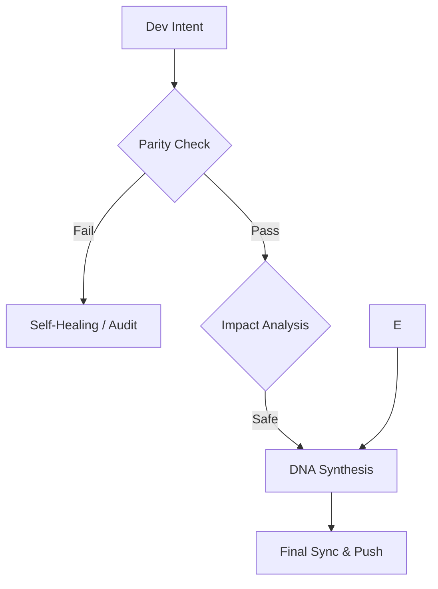

# Continuity Legacy: Persistent Governance Layer 

[](https://github.com/SteveBlackbeard/CONTINUITY-LEGACY-by-Ethernium/actions/workflows/industrial_guardian.yml)
[](https://github.com/SteveBlackbeard/CONTINUITY-LEGACY-by-Ethernium/releases)
[](https://github.com/SteveBlackbeard/CONTINUITY-LEGACY-by-Ethernium/blob/main/LICENSE)
[](https://www.python.org/downloads/release/python-3100/)

#### Languages
[](https://github.com/SteveBlackbeard/CONTINUITY-LEGACY-by-Ethernium/blob/main/OTHER_LANGUAGES/RELEASE_v2.1.0_es.md) [](https://github.com/SteveBlackbeard/CONTINUITY-LEGACY-by-Ethernium/blob/main/RELEASE_NOTES_MANIFEST.md) [](https://github.com/SteveBlackbeard/CONTINUITY-LEGACY-by-Ethernium/blob/main/OTHER_LANGUAGES/RELEASE_v2.1.0_ja.md) [](https://github.com/SteveBlackbeard/CONTINUITY-LEGACY-by-Ethernium/blob/main/OTHER_LANGUAGES/RELEASE_v2.1.0_zh.md) [](https://github.com/SteveBlackbeard/CONTINUITY-LEGACY-by-Ethernium/blob/main/OTHER_LANGUAGES/RELEASE_v2.1.0_ru.md) [](https://github.com/SteveBlackbeard/CONTINUITY-LEGACY-by-Ethernium/blob/main/OTHER_LANGUAGES/RELEASE_v2.1.0_fr.md) [](https://github.com/SteveBlackbeard/CONTINUITY-LEGACY-by-Ethernium/blob/main/OTHER_LANGUAGES/RELEASE_v2.1.0_it.md) [](https://github.com/SteveBlackbeard/CONTINUITY-LEGACY-by-Ethernium/blob/main/OTHER_LANGUAGES/RELEASE_v2.1.0_de.md) [](https://github.com/SteveBlackbeard/CONTINUITY-LEGACY-by-Ethernium/blob/main/OTHER_LANGUAGES/RELEASE_v2.1.0_pt.md)

<p align="center">

  

</p>

<!-- DNA_CRYSTAL -->
> [!IMPORTANT]
> **DNA CRYSTAL**: `v2.1.0-3759847611631fa4`
> [](https://github.com/SteveBlackbeard/CONTINUITY-LEGACY-by-Ethernium)
## 🏛️ Table of Contents
1. [Choose Your Edition](#-choose-your-edition)
2. [Technical Specifications](#-technical-specifications-hardware-profiles)
3. [30-Second Quickstart](#-30-second-quickstart-the-onboarding-experience)
4. [Quick Installation](#-quick-installation)
5. [Operation Modes](#-modos-de-operación-how-to-use)
6. [Core Infrastructure](#-core-infrastructure-the-cognitive-core)
7. [The Quality Flow](#-the-quality-flow-the-border-guard)
8. [Guardian DNA Algorithm](#-guardian-dna-technical-specification)
9. [Origins: The Ethernium Heritage](#-origins-the-ethernium-heritage)

---


## 🏛️ Choose Your Edition

[](https://github.com/SteveBlackbeard/CONTINUITY-LEGACY-by-Ethernium/blob/main/continuity-lite/)
_Minimalist local sync with DNA Synthesis for zero-loss handoffs._

[](https://github.com/SteveBlackbeard/CONTINUITY-LEGACY-by-Ethernium/blob/main/continuity-pro/)
_Industrial-grade border guard. Features military-grade cyber-security, RFC 6962 Merkle Hardening, and Fail-Closed Hooks._

[](https://github.com/SteveBlackbeard/CONTINUITY-LEGACY-by-Ethernium/blob/main/continuity-omega/)
_Advanced RAG, cognitive mapping, and a stunning 3D Glassmorphic Dashboard for visceral data visualization._
| Guide | Link |
| :--- | :--- |
| [**Industrial Guide**](../HOW_TO_USE_IT.md) | [HOW_TO_USE_IT.md](../HOW_TO_USE_IT.md) |
| [**Release Manifest**](../RELEASE_NOTES_MANIFEST.md) | [RELEASE_NOTES_MANIFEST.md](../RELEASE_NOTES_MANIFEST.md) |

---

## 🛡️ Sovereign Edition Security (v2.1.0)
The v2.1.0 release establishes a "Fail-Closed" military doctrine to protect the DNA Lineage:
- **RFC 6962 Merkle Hardening**: Domain separation (0x00/0x01) prevents second-preimage attacks.
- **Strict Sentinel Hooks**: Pre-push and pre-commit hooks dynamically resolve safe paths to prevent PATH hijacking and force `exit 1` on drift detection.
- **Sovereign Collaboration**: Hardware binding was explicitly removed to allow open-source teams to share the exact same `STATE.json` safely.

---

## 📊 Technical Specifications (Hardware Profiles)
Each edition is optimized for specific resource footprints:

| Edition | RAM (Min) | Storage | Dependencies | Best For |
| :--- | :--- | :--- | :--- | :--- |
| **Lite** | < 100 MB | < 5 MB | Zero | Local Dev / CI-CD |
| **Pro** | 4 GB | 50 MB | Standard | Industrial Handoffs |
| **Omega** | 16 GB+ | 500 MB+ | RAG/Graph | Enterprise Strategy |

---

## ⏱️ 30-Second Quickstart (The Onboarding Experience)

> **`example-project/`** is a pre-configured sandbox included in this repository. It simulates a real project already managed by Continuity Legacy.

1.  **Navigate to the example environment**:
    ```bash
    cd example-project
    ```
2.  **Verify the DNA Parity**:
    ```bash
    python ../continuity-lite/run_continuity_lite.py check
    ```
3.  **Expected Outcome**: You will see a green `[✔] Parity Confirmed`.

---

##  Installation (Quick)


```bash

# Install the Lite edition from its folder

pip install -e .


# Setup the DNA Guardian Entry Point

continuity-lite --hook

```


---


## 🏛️ Arquitectura: Cúmulo de Memoria (Memory Core)
Continuity Legacy utiliza un diseño de **Desacoplamiento Total**. Las ediciones no son un bloque monolítico, sino herramientas independientes que operan sobre una única fuente de verdad:

*   **Independencia Absoluta**: El uso de `Lite` no consume recursos de `Pro` o `Omega`. Los motores solo consumen RAM/CPU bajo demanda.
*   **Sustrato Común**: Todas las ediciones comparten el `.continuity/STATE.json` y el `PROJECT_CONTEXT.md`.
*   **Interoperabilidad Pasiva**: Un cambio registrado por una edición es visible de inmediato para las demás, garantizando que el linaje lógico fluya sin fricción.

---

## 🚀 Modos de Operación (How to use)
Continuity Legacy puede integrarse en su flujo de trabajo de tres maneras principales:

1.  **Modo Autónomo (CLI)**: Ejecute `continuity-lite status` o `check` manualmente.
2.  **Modo Centinela (Automatic Guardian)**: Use `continuity-lite init` para instalar los Git-Hooks automáticamente.
3.  **Modo Auditor (Manual DNA)**: Use el script de paridad para generar informes de deriva.

---

## 🧩 Core Infrastructure (The Cognitive Core)
Continuity organiza la inteligencia del proyecto en nodos estructurados:
*   **`.continuity/`**: El núcleo de memoria con `TIMELINE.md` y `DECISIONS_LOG.md`.
*   **`STATE.json`**: Instantánea de estado protegida por firma SHA-256.
*   **`PROJECT_CONTEXT.md`**: Define las reglas y el alma estratégica del sistema.

---

## 🔍 The Quality Flow (The Border Guard)
Continuity actúa como un "Socratic Firewall". Protege tu intención de diseño mediante un bucle de validación determinista:



---

## 🧬 Guardian DNA (Technical Specification)
**Continuity Legacy** utiliza un algoritmo de hashing "Nucleótido" determinista para generar la identidad única de un proyecto.

- **Nucleotide Hashing**: Cada artefacto canónico (`.md`, `.json`) es procesado usando **SHA-256**.
- **DNA Synthesis**: El sistema agrega estos segmentos en un **Merkle Tree** jerárquico.
- **The Merkle Root**: El hash final que representa el **Estado Absoluto**.

---

## 🌌 Origins: The Ethernium Heritage
**Continuity Legacy** nació de la necesidad sistémica dentro del **Ecosistema Ethernium**, una frontera en evolución de computación cognitiva y sistemas autónomos. Donde los reinicios de sesión ocurren millones de veces, el riesgo de "Entropía Semántica" era crítico. Necesitábamos asegurar que el *alma* de un proyecto transicionara de una instancia cognitiva a la siguiente sin pérdidas ni deriva.

 

##  Minimal Usage


```bash

# Run the DNA validation cycle

continuity-lite

```


---


##  Hardware Profile

- **CPU**: Minimal (Any).

- **RAM**: < 100MB.

- **Python**: 3.7+ (No external dependencies).

---
*Continuity Legacy: Protecting the logical lineage of your software.*
