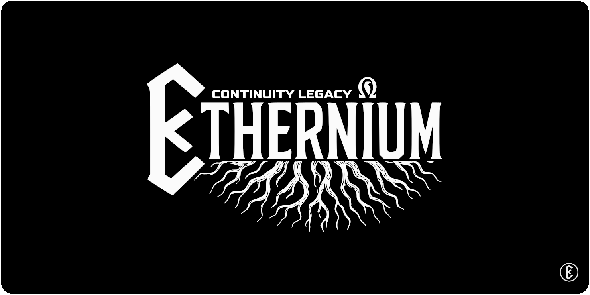

# Continuity Legacy v3.0.3 Release Candidate

<p align="center">
  
</p>

## Positioning

Continuity Legacy `v3.0.3` is the governed release candidate for the Python framework line. It keeps the runtime API stable and raises the repository around it: rulebook, feature registry, live handoff, golden baseline verification, health guard, and explicit separation from dashboard tooling.

This is not a dashboard release. Continuity Conekta is a separate product and repository. AgentOps is an incubated tool, documented separately and not required for this release.

## Package Lines

| Package | Role | Version target |
| --- | --- | --- |
| `ethernium-continuity-legacy` | Meta package and unified entrypoints | `3.0.3` |
| `ethernium-continuity-lite` | Minimal continuity handoff tooling | `3.0.3` |
| `ethernium-continuity-pro` | Industrial guard, audits, sync, token tools | `3.0.3` |
| `ethernium-continuity-omega` | Advanced RAG, cognitive map, oracle layer | `3.0.3` |

## Quality Gates

Run these before creating the GitHub release or publishing PyPI artifacts:

```powershell
python scripts\golden_baseline.py verify
python scripts\health_guard.py --strict
python scripts\autophagy_report.py
pytest -q
python -m build
python -m twine check dist\*
```

For package-level confidence, build and check each edition from its own folder before upload.

## Release Contract

- Runtime API: unchanged.
- Dashboard: excluded from Legacy; use Continuity Conekta as a separate repo.
- AgentOps: documented as separate future tooling.
- External prompt leaks: no copied content; only original governance and operations principles.
- PyPI: `3.0.2` is already published, so the next upload must use `3.0.3`.

## GitHub Release Draft

Title:

```text
v3.0.3 - Governed Release Candidate
```

Summary:

```text
Continuity Legacy v3.0.3 turns the Python framework into a governed continuity platform: explicit rulebook, feature registry, live handoff, golden baseline verification, health guard, and clean separation from Continuity Conekta.
```

Highlights:

- Governed baseline with contract-required refresh.
- Health guard for protected paths, split boundaries, and release hygiene.
- Root documentation cleaned and aligned around the canonical Ethernium banner.
- KO and AR documentation entry points added.
- Conekta remains external; Legacy stays a Python framework.
- AgentOps remains incubated and non-blocking.

Release checklist:

- Local gates pass.
- GitHub CI is green.
- Tag is created only after CI.
- PyPI upload is optional and uses `3.0.3`.
